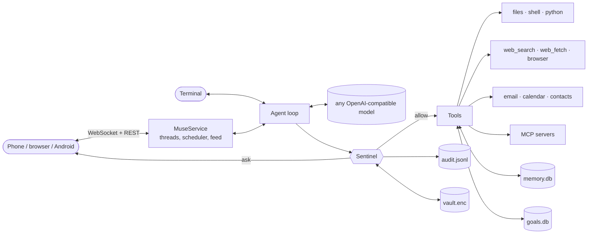

<p align="center">
  
</p>

<h1 align="center">nanoMuse</h1>

<div align="center">
  <p>
    <a href="https://github.com/nano-muse/nanoMuse/blob/main/README.md">English</a> |
    <a href="https://github.com/nano-muse/nanoMuse/blob/main/README_zh.md">简体中文</a> |
    <a href="https://nano-muse.github.io/nanoMuse/">Website</a>
  </p>
  <p>
    <a href="https://github.com/nano-muse/nanoMuse"></a>
    <a href="https://pypi.org/project/nanomuse/"></a>
    <a href="https://github.com/nano-muse/nanoMuse/releases/latest/download/nanomuse.apk"></a>
    <a href="https://github.com/nano-muse/nanoMuse/actions/workflows/ci.yml"></a>
    <a href="https://pypi.org/project/nanomuse/"></a>
    <a href="https://github.com/nano-muse/nanoMuse/blob/main/LICENSE"></a>
  </p>
</div>

🐾 **nanoMuse** is an open-source personal AI agent inspired by Meta's [Muse](https://about.fb.com/news/2026/09/introducing-muse-personal-ai-agent/). One agent with a name and a face, yours: it does things instead of answering questions, keeps working while the app is closed, remembers you, and asks before anything you could not undo. It works through whatever the job needs — the web, files and commands, MCP servers and command-line tools (飞书, 高德), skills, and the apps on your phone through their screens where there is no API (12306, WeChat, Alipay). Any OpenAI-compatible model. Today it is an Android app and a web app served by one Python package from your own machine, no cloud VM; a hosted web version on a per-user VM and a desktop app come next ([roadmap](#roadmap)).

<p align="center">
  
  
  
  
</p>

<p align="center">
  <a href="https://nano-muse.github.io/nanoMuse/#video">▶ Watch the 66-second film</a> · <a href="https://nano-muse.github.io/nanoMuse/">the website</a> · <a href="https://demo.nanomuse.dev">the hosted demo</a>
</p>

## Start Here

| You want to... | Go to |
|---|---|
| Get it on your phone in five minutes | [Install](#-install) and [Quick Start](#-quick-start) |
| Install the Android app | [Android](#-android) |
| Use it from the terminal | [CLI](https://github.com/nano-muse/nanoMuse/blob/main/docs/cli.md) |
| Point it at DeepSeek, OpenAI, Ollama or a company gateway | [Models](#-models) and [Configuration](https://github.com/nano-muse/nanoMuse/blob/main/docs/configuration.md) |
| Know what it will and will not do on its own | [Sentinel](#%EF%B8%8F-sentinel) and [docs/sentinel.md](https://github.com/nano-muse/nanoMuse/blob/main/docs/sentinel.md) |
| Connect mail, a calendar, contacts, a browser or MCP servers | [Connectors](https://github.com/nano-muse/nanoMuse/blob/main/docs/configuration.md#connectors) |
| Let it operate the apps on a phone (12306, WeChat, Alipay) | [docs/gui.md](https://github.com/nano-muse/nanoMuse/blob/main/docs/gui.md) and the [simulated phone](https://github.com/nano-muse/nanoMuse/blob/main/demo/mobilegym/README.md) |
| See what to ask it — 飞书 through its CLI, 高德 through MCP, the phone, all three at once | [Showcase](https://github.com/nano-muse/nanoMuse/blob/main/docs/showcase.md) |
| Run it in Docker or keep it running on a server | [Deploy](#%EF%B8%8F-deploy) |
| Know where it is going — phone now, web on a cloud VM and desktop next | [Roadmap](#roadmap) and [docs/roadmap.md](https://github.com/nano-muse/nanoMuse/blob/main/docs/roadmap.md) |
| Read the code | [Architecture](#architecture) |

## What can nanoMuse do?

nanoMuse is a personal agent you talk to from your phone. It can:

- research, write pages and documents, run shell commands and Python, send mail, read your calendar and your contacts, browse the web
- use the tools a service already has: any [MCP](https://modelcontextprotocol.io) server (高德地图 for places, routes and weather) and any command-line tool (飞书 through lark-cli: your agenda, a message to a colleague, an event, a document) — no screen involved ([showcase](https://github.com/nano-muse/nanoMuse/blob/main/docs/showcase.md))
- operate the apps on your phone through their screens when there is no API — look up trains in 12306, read and answer WeChat, work through Alipay — with a switch, and a stop at every send or pay button ([docs/gui.md](https://github.com/nano-muse/nanoMuse/blob/main/docs/gui.md))
- stop and ask before anything hard to undo, with an approval you scope (once, this task, always) and can revoke
- work on goals over weeks while the app is closed, check in on a schedule, and start work when mail arrives, an event is near or a webhook fires
- write you a feed: short posts from what it knows about you and what you asked it to follow
- remember you in a memory you can read, edit and forget, and recall it by meaning
- follow skills in the [Agent Skills](https://agentskills.io) format — nine built in, yours in a folder, other agents' skills as they are
- run on any OpenAI-compatible model: DeepSeek, OpenAI, OpenRouter, Ollama, vLLM, a gateway with its own headers

## 💡 Why nanoMuse

- **The Muse shape, in the open**: chat, feed, ideas, goals and library on a phone; a red panda at the top of the chat that changes pose with what the agent is doing; one agent, not a bot framework.
- **One agent, many hands**: the same agent reaches a service through its API, its MCP server, its command-line tool, a browser, or — last — the screen of the app on your phone. The Sentinel sits between it and all of them.
- **Safety is the architecture**: the agent never touches a tool directly. A `Sentinel` decides allow / ask / deny per call, keeps secrets out of the model, tracks where private data goes, and logs everything. On Linux every command runs in its own [bubblewrap](https://github.com/containers/bubblewrap) sandbox.
- **Your machine, your model**: runs on a laptop, a home server or in Docker. Chat Completions or the Responses API, streaming, native or prompt-based tool calling, local models included.
- **Small enough to read**: about 18k lines of typed Python, 11k of TypeScript and 800 of Kotlin. No orchestration framework underneath. About 240 tests.

## Where it runs

Muse is a set of clients — iOS, Android, the web, WhatsApp, a Mac app — around one agent that runs in a cloud VM per user. nanoMuse takes the same shape one platform at a time, and starts where the VM is not needed:

| | Meta Muse | nanoMuse |
|---|---|---|
| Phone | iOS and Android apps, thin clients of the VM | **Now.** An Android app and a web app; the agent runs on your computer, a home server or in Docker — no cloud VM. Next inside this phase: a local build with the brain inside the APK — the whole agent, complete with the phone operator off — and, with that switch on, the app operating real apps through an accessibility service. |
| Web | muse.ai, the same VM | **Next.** A hosted nanoMuse: a VM per user, sign in from any browser, the same agent and Sentinel, your own key or a starter quota. |
| Desktop | a Mac app, the same VM | **Later.** A desktop app in two versions — local (the agent, its tools and its browser on the computer you sit at) and attached to your cloud VM. |

Operating a phone through its screen, running without a cloud VM, and knowing Chinese services are features of the first phase, not the definition. [docs/roadmap.md](https://github.com/nano-muse/nanoMuse/blob/main/docs/roadmap.md) has the plan in full.

## 📦 Install

Python 3.11 or newer, on Linux, macOS or Windows. The phone app ships inside the package; Node is only needed to change `web/`. The Android app is a separate download, see [Android](#-android).

| Track | Install with | Update with |
|---|---|---|
| Stable | `uv tool install nanomuse` or `pip install nanomuse` | the same tool, `--upgrade` |
| Latest | `uv tool install git+https://github.com/nano-muse/nanoMuse.git` | run it again |
| Source | `git clone` + `uv pip install -e ".[dev]"` | `git pull` |

```bash
uv tool install nanomuse
nanomuse version
```

Optional: `nanomuse[browser]` adds the Playwright browser tool (then `playwright install chromium`).

## 🚀 Quick Start

```bash
nanomuse config init                 # writes config/config.toml
export DEEPSEEK_API_KEY=sk-...       # the default config uses DeepSeek; see Models below
nanomuse serve --host 0.0.0.0        # prints a URL and a QR code
```

Scan the QR code with your phone on the same Wi-Fi, or open the URL here. The link carries the access token. Setup runs the first time: your name, the agent's name and face, the model. Then try:

1. *"Compare the Sony WH-1000XM6 and Bose QuietComfort Ultra for long flights and save a short comparison to headphones.md"*
2. *"Check how much free disk space this machine has"*, which stops on an approval card
3. *"Set up a goal: conversational Japanese before my Kyoto trip in December, 30 minutes a day"*, then open Goals

Prefer the terminal? `nanomuse chat` is the same agent with approvals in the console; `nanomuse run "task"` does one task and exits. Something off? `nanomuse doctor` checks the config, the model and the connectors and says what to fix.

## 📱 Android

[**Download nanomuse.apk**](https://github.com/nano-muse/nanoMuse/releases/latest/download/nanomuse.apk) from the latest release and open it on the phone. Android 8.0 or newer, a 64-bit phone. It is not from a store, so Android asks once to allow the install.

The first screen asks where your nanoMuse should live:

- **Run on this phone.** The whole agent is inside the APK — a small Alpine Linux with Python and `nanomuse`, unpacked on first start and run under a user-mode chroot, no root. Nothing to install on a computer: name the agent, paste a model key, done. It keeps working in the background and comes back after a reboot. About 330 MB of storage. ([how it works](https://github.com/nano-muse/nanoMuse/blob/main/docs/local-runtime.md))
- **Connect to my computer.** `nanomuse serve --host 0.0.0.0` on the computer, tap **Scan QR code**, point the camera at the terminal. Same Wi-Fi, a VPN such as Tailscale, or your server behind TLS all work. There is also a smaller [`nanomuse-connect.apk`](https://github.com/nano-muse/nanoMuse/releases/latest/download/nanomuse-connect.apk) with only this mode, for any CPU.

What the app adds over the browser tab:

- notifications while the app is closed: approvals, questions and the last word of background work, each opening the right chat
- the phone's own capabilities as tools: clipboard, notifications, calendar, contacts, location, alarms and timers, photos through the system picker — every permission is Android's own dialog, each tool has its own Sentinel default ([docs/device.md](https://github.com/nano-muse/nanoMuse/blob/main/docs/device.md))
- the agent's shell can use the phone too: `nanomuse-device`, `nanomuse-browser` and `nanomuse-open` inside the sandbox reach the same tools and the in-app browser — under the same Sentinel
- the workspace in the Files app, and **Share → nanoMuse** from any app to start a conversation about a text, a link or a file
- the phone's own browser: the agent browses in the app's WebView, at full speed in the background, and *Take over* hands you the real page to sign in on — then **Done** and it continues ([docs/browser.md](https://github.com/nano-muse/nanoMuse/blob/main/docs/browser.md))
- connect by QR code, plain `http://` on the LAN
- the file picker for attachments, downloads to the phone, links in the real browser

No Android? Add the web app to the home screen instead; it installs as a PWA and gets Web Push over `https://`. Build the APK yourself or read how it works in [docs/android.md](https://github.com/nano-muse/nanoMuse/blob/main/docs/android.md).

## ☁️ Deploy

```bash
docker run -d --name nanomuse -p 8787:8787 -e DEEPSEEK_API_KEY=sk-... \
  -v nanomuse-data:/data -v "$PWD/workspace:/workspace" \
  ghcr.io/nano-muse/nanomuse:latest
docker logs nanomuse            # the URL with the access token
```

The image is linux/amd64 and linux/arm64; `:latest-browser` bundles Chromium for the browser tool. From a checkout, `docker compose up -d app` does the same and `docker compose up -d daemon` advances goals with no UI. To reach it from outside your network, put it behind Tailscale or a reverse proxy with TLS rather than opening the port. Details, including a systemd unit: [docs/deployment.md](https://github.com/nano-muse/nanoMuse/blob/main/docs/deployment.md).

## 🌐 The app

`nanomuse serve` runs the agent and serves the app from one process: FastAPI with a WebSocket for live events, React on the phone, built into the package.

| Screen | What you get |
|---|---|
| Chat | One main conversation and side chats. Replies stream in; tool calls show as chips you can open; files it writes open in the app. Approval and question cards appear inline. Attach photos and files; watch it browse and take over for a sign-in. |
| Feed | *Feed instructions* in your words, and posts the agent writes from them once a day or on demand. Below, what happened while you were away and every card still waiting for you. |
| Ideas | Things to ask next, from your goals, memory and recent conversation, grouped by area. Tap one to send it. |
| Goals | *Tracking*: checked on a schedule. *Goals*: done step by step. Each with a plan, a target date, notes, and a proposal when the plan no longer fits. A proactivity dial and quiet hours set how much it does on its own. |
| Library | Everything it made, newest first, with previews. Pages render in a sandbox that cannot reach your token. |
| Avatar | Tap it: the status and a *Stop* button, approvals across all chats, the activity log, permissions you granted, what is upcoming, memory, skills, connections, settings. |

Reminders ("remind me at six to call mum"), routines ("every weekday at 07:30, a one-line weather check") and triggers (new mail, a calendar event, a webhook) are set from the chat and listed under *Upcoming*. Everything the app does goes through a REST + WebSocket API, documented in [docs/app.md](https://github.com/nano-muse/nanoMuse/blob/main/docs/app.md), so another front-end can drive the same agent.

## 🛡️ Sentinel

Every tool call goes through `Sentinel` before it runs. Tools declare a risk level and can raise it for a specific call (`shell` on `rm -rf`, `web_fetch` on a private address). First match wins:

1. `deny_tools` → deny
2. `[[sentinel.rules]]` matching the arguments → the rule's action
3. `always_allow_tools` / `always_ask_tools`
4. Taint: private data was read this session **and** this call sends data outside `egress_allowlist` → ask
5. Risk × mode: `ask` asks for sensitive calls, `strict` also for moderate ones, `auto` allows what is not denied
6. A call with a warning (`sudo`, `curl | sh`, code that deletes files) asks whatever the mode

```toml
[sentinel]
mode = "ask"                              # ask | strict | auto
always_ask_tools = ["send_email", "shell"]
egress_allowlist = ["*.wikipedia.org", "github.com", "*.github.com"]

[[sentinel.rules]]
tool   = "shell"
match  = { command = "*rm -rf*" }
action = "deny"
```

Secrets live in an encrypted vault (`nanomuse vault set EMAIL_PASSWORD`, or the Connections screen) and are referenced as `{{vault:EMAIL_PASSWORD}}`; Sentinel fills them in right before a call and redacts them from the output, so the model never sees one. Every decision goes to `audit.jsonl`. What is and is not covered: [docs/sentinel.md](https://github.com/nano-muse/nanoMuse/blob/main/docs/sentinel.md); reporting: [SECURITY.md](https://github.com/nano-muse/nanoMuse/blob/main/SECURITY.md).

## 🧠 Models

Any OpenAI-compatible endpoint. Edit `[llm]` in `config/config.toml`, or pick a preset under *Connections* on the phone:

```toml
[llm]
provider = "openai"                    # Chat Completions; "openai_responses" for the Responses API
model    = "deepseek-flash"
base_url = "https://api.deepseek.com"
api_key  = "${DEEPSEEK_API_KEY}"

# OpenAI:      model = "gpt-5.6-sol"  base_url = "https://api.openai.com/v1"   api_key = "${OPENAI_API_KEY}"
# Ollama:      model = "qwen3:8b"     base_url = "http://localhost:11434/v1"   api_key = "ollama"
# OpenRouter:  model = "deepseek/deepseek-flash"  base_url = "https://openrouter.ai/api/v1"
# A gateway that needs headers:  extra_headers = { "X-End-User-Id" = "nanomuse" }
# An endpoint that ignores `tools`:  tool_mode = "prompt"
```

Or `NANOMUSE_LLM_MODEL`, `NANOMUSE_LLM_BASE_URL`, `NANOMUSE_LLM_API_KEY`, `NANOMUSE_LLM_PROVIDER`. Local models work: `qwen3:8b` on Ollama passes the [provider check](https://github.com/nano-muse/nanoMuse/blob/main/scripts/provider_check.py) with native tool calling, `gemma3:4b` through the prompt fallback. Full reference: [docs/configuration.md](https://github.com/nano-muse/nanoMuse/blob/main/docs/configuration.md).

## Architecture



| Area | Files |
|---|---|
| Agent loop, system prompt, context window | `nanomuse/agent/core.py`, `nanomuse/prompts.py` |
| Sentinel: policy, approvals, taint, audit; the sandbox | `nanomuse/sentinel/`, `nanomuse/sandbox.py` |
| Credential vault | `nanomuse/vault/` |
| Tools and the MCP adapter | `nanomuse/tools/` |
| LLM providers, `<think>` filter, prompt-based tool calling | `nanomuse/llm/` |
| Memory, goals, skills | `nanomuse/memory/`, `nanomuse/goals/`, `nanomuse/skills/` |
| App server: service, REST/WebSocket API, timeline | `nanomuse/server/` |
| Phone app (React, Vite, Tailwind) | `web/` → built into `nanomuse/server/static/` |
| Android app (Kotlin, WebView, notification service) | `android/` |
| Terminal UI and CLI | `nanomuse/console.py`, `nanomuse/cli.py` |

More in [docs/architecture.md](https://github.com/nano-muse/nanoMuse/blob/main/docs/architecture.md).

## nanoMuse and Meta Muse

| Meta Muse | nanoMuse |
|---|---|
| Runs in a per-user secure VM | Runs on your machine or in Docker; on Linux each `shell` / Python call gets its own bubblewrap namespace |
| Sentinel approves sensitive actions | `Sentinel`: allow / ask / deny, rules, taint tracking, egress allowlist, scoped approvals |
| Credentials never reach the model | Encrypted vault, `{{vault:NAME}}` placeholders, output redaction |
| Remembers you | SQLite memory the agent keeps tidy and you can edit, recalled by keyword and by meaning |
| Works on goals in the background | Goals with steps; a scheduler advances them and reports to the chat |
| A feed written for you | Posts from your instructions and what it knows, once a day or on demand |
| iOS, Android, the web, WhatsApp and a Mac app, all clients of the VM | An Android app and a web app installable to the home screen today; the web on a cloud VM and a desktop app next |
| A plush doll that changes pose while it works | A red panda drawn live, with a pose for idle, working, waiting, done, failed and offline |
| Western services through their APIs | The same, plus 飞书 through its CLI, 高德 through MCP, and 12306 / WeChat / Alipay through the phone's screen |
| Meta's models | Any OpenAI-compatible model |
| Closed | MIT |

## Docs

- [Configuration](https://github.com/nano-muse/nanoMuse/blob/main/docs/configuration.md): every setting, environment overrides, connectors, MCP, local models
- [Sentinel](https://github.com/nano-muse/nanoMuse/blob/main/docs/sentinel.md): policy order, rules, taint tracking, vault, audit, the sandbox
- [Operating the phone](https://github.com/nano-muse/nanoMuse/blob/main/docs/gui.md): the switch, the operator and its model, what asks first, traces, the device protocol
- [Showcase: what to ask it](https://github.com/nano-muse/nanoMuse/blob/main/docs/showcase.md): 飞书 through lark-cli, 高德 through MCP, the phone's apps, none of it, and asks that mix them
- [Roadmap](https://github.com/nano-muse/nanoMuse/blob/main/docs/roadmap.md): the phone without a cloud VM, then the web on one, then the desktop both ways
- [Design](https://github.com/nano-muse/nanoMuse/blob/main/docs/design.md): what was learned from Muse's screens — type, colour, layout, the avatar's poses — and how nanoMuse maps them
- [The app and its API](https://github.com/nano-muse/nanoMuse/blob/main/docs/app.md): screens, phone access, tokens, every endpoint
- [Android](https://github.com/nano-muse/nanoMuse/blob/main/docs/android.md): install, notifications, building and signing
- [CLI](https://github.com/nano-muse/nanoMuse/blob/main/docs/cli.md): `chat`, `run`, `serve`, `daemon`, `goals`, `memory`, `skills`, `vault`, `phone`, `audit`, `doctor`
- [Architecture](https://github.com/nano-muse/nanoMuse/blob/main/docs/architecture.md): source map and extension points
- [Deployment](https://github.com/nano-muse/nanoMuse/blob/main/docs/deployment.md): Docker, Compose, systemd, TLS
- [Troubleshooting](https://github.com/nano-muse/nanoMuse/blob/main/docs/troubleshooting.md)
- [A simulated phone](https://github.com/nano-muse/nanoMuse/blob/main/demo/mobilegym/README.md): nanoMuse as a native app on MobileGym, notifications included, in one browser tab

## Releases

**v0.1.0 is the first release** and is being prepared: the agent and its Sentinel, the web app, the Android app, the phone operator on the simulated phone, the hosted showcase. Until it is tagged, `main` is the version to run — `pip install git+https://github.com/nano-muse/nanoMuse.git` or the `ghcr.io/nano-muse/nanomuse:edge` image.

[CHANGELOG.md](https://github.com/nano-muse/nanoMuse/blob/main/CHANGELOG.md) · [GitHub releases](https://github.com/nano-muse/nanoMuse/releases)

## Roadmap

Three phases, one per platform; the full plan with the reasoning is in [docs/roadmap.md](https://github.com/nano-muse/nanoMuse/blob/main/docs/roadmap.md).

**Phase 1 — the phone, no cloud VM** (now)

- [x] The agent, the Sentinel, the vault, the sandbox; the web app; the Android app; skills and MCP; 飞书 and 高德 without a screen
- [x] The phone operator on the simulated phone, with traces
- [ ] Local build: the brain inside the APK, so the phone needs no server at all — the whole agent, complete with the phone operator switched off
- [ ] Android executor: with the switch on, the app operates real apps through an accessibility service (screenshots, gestures, the finger overlay), with Shizuku as an option
- [ ] Free starter quota through the showcase gateway, then your own key
- [ ] Muse features still missing: durable tasks with a take-over hand-off, watches that trigger on the world, ideas with evidence, a follow-up queue
- [ ] Voice: speak a message and see it as text before it goes, through any OpenAI-compatible `/audio/transcriptions`

**Phase 2 — the web, on a cloud VM**

- [ ] A hosted nanoMuse: one VM per user with the agent, its browser and its files inside; sign in from any browser; the same Sentinel; your own key or the starter quota
- [ ] The Android and web apps as clients of your VM as well as of your own machine

**Phase 3 — the desktop, both ways**

- [ ] A desktop app that runs the agent locally, with the files and browser of the computer you sit at
- [ ] The same app attached to your cloud VM
- [ ] iOS: the same shell as the Android app

## 🤝 Contribute

Use nanoMuse for a real task, report what broke, then pick something focused.

- [CONTRIBUTING.md](https://github.com/nano-muse/nanoMuse/blob/main/CONTRIBUTING.md) has the development setup; CI runs `ruff`, `pytest`, the web build and the Android build.
- [Open issues](https://github.com/nano-muse/nanoMuse/issues) for problems to look into.
- A [pull request](https://github.com/nano-muse/nanoMuse/pulls) for a focused fix. Another language for the app is one dictionary file in `web/src/i18n/`.

## Acknowledgements

nanoMuse stands on other people's work. [THIRD_PARTY_NOTICES.md](https://github.com/nano-muse/nanoMuse/blob/main/THIRD_PARTY_NOTICES.md) has the terms; the short list:

- [MobileGym](https://github.com/Purewhiter/mobilegym) — the simulated Android phone the showcase runs on, with Chinese apps as React apps in the browser; the finger overlay follows its touch feedback.
- [MemGUI-Bench](https://github.com/lgy0404/MemGUI-Bench) — the `mobile_use` operator prompt and loop the phone operator is ported from.
- [PhoneHarness](https://github.com/lsdefine/PhoneHarness) — deterministic-first routing and the JSONL-trace-to-HTML idea.
- [CopilotKit/OpenMuse](https://github.com/CopilotKit/OpenMuse) — product designs for durable tasks, watches, ideas with evidence and the follow-up queue.
- [Open-AutoGLM](https://github.com/zai-org/Open-AutoGLM) and [ClawGUI](https://github.com/ClawGUI/ClawGUI-APP) — reference points for the Android executor.
- [modern-screenshot](https://github.com/qq15725/modern-screenshot), [Caddy](https://github.com/caddyserver/caddy) and its Cloudflare modules, [Figtree](https://github.com/erikdkennedy/figtree), [bubblewrap](https://github.com/containers/bubblewrap).

Related: [nanobot](https://github.com/HKUDS/nanobot) is a personal assistant framework for chat apps (Telegram, Discord, Slack, WeChat) — pick it for a bot in the channels you already use; [browser-use](https://github.com/browser-use/browser-use) is where the browser tool's element annotation comes from.

## Disclaimer

nanoMuse is an independent community project. It is not affiliated with, endorsed by, or derived from Meta Platforms, Inc. or its Muse product. The red panda and the plush avatars are the project's own; the name and the design ideas are used for comparison.

## License

[MIT](https://github.com/nano-muse/nanoMuse/blob/main/LICENSE)
