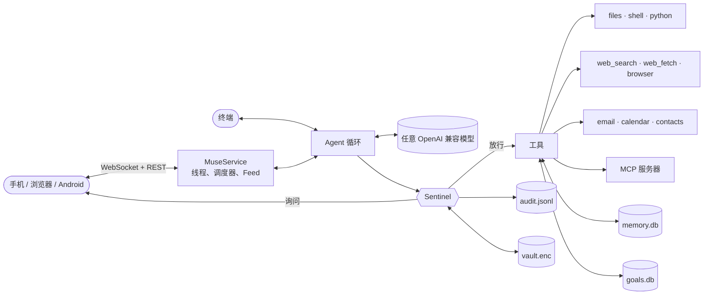

<p align="center">
  
</p>

<h1 align="center">nanoMuse</h1>

<div align="center">
  <p>
    <a href="https://github.com/nano-muse/nanoMuse/blob/main/README.md">English</a> |
    <a href="https://github.com/nano-muse/nanoMuse/blob/main/README_zh.md">简体中文</a>
  </p>
  <p>
    <a href="https://github.com/nano-muse/nanoMuse"></a>
    <a href="https://pypi.org/project/nanomuse/"></a>
    <a href="https://github.com/nano-muse/nanoMuse/releases/latest/download/nanomuse.apk"></a>
    <a href="https://github.com/nano-muse/nanoMuse/actions/workflows/ci.yml"></a>
    <a href="https://pypi.org/project/nanomuse/"></a>
    <a href="https://github.com/nano-muse/nanoMuse/blob/main/LICENSE"></a>
  </p>
</div>

🧸 **nanoMuse** 是一个开源、自托管的个人 Agent，形态照着 Meta 的 [Muse](https://about.fb.com/news/2026/09/introducing-muse-personal-ai-agent/) 来，并且为中国大陆做了适配：一个有名字、有脸的 Agent，住在你手机里，替你做事而不只是回答问题，关掉 App 也继续干活，做任何不可撤销的事之前先问你。Muse 依赖的那些有 API 的海外服务，在国内多半没有对应；nanoMuse 会以 GUI Agent 的方式直接操作你手机上的 App（12306、微信、支付宝……）的界面，让同一个 Agent 在没有 API 的地方也能干活。任何 OpenAI 兼容模型都能跑。一个 Python 包，网页 App 内置其中，另有一个 Android App。

> nanoMuse 在 0.6.0 之前叫 **OpenMuse**，和 CopilotKit 的同名项目没有关系。

<p align="center">
  
  
  
  
</p>

## 从这里开始

| 你想… | 看这里 |
|---|---|
| 五分钟装到手机上 | [安装](#-安装) 和 [快速开始](#-快速开始) |
| 装 Android App | [Android](#-android) |
| 在终端里用 | [CLI](https://github.com/nano-muse/nanoMuse/blob/main/docs/cli.md) |
| 接 DeepSeek、OpenAI、Ollama 或公司网关 | [模型](#-模型) 和 [配置](https://github.com/nano-muse/nanoMuse/blob/main/docs/configuration.md) |
| 搞清楚它什么会自己做、什么会先问 | [Sentinel](#%EF%B8%8F-sentinel) 和 [docs/sentinel.md](https://github.com/nano-muse/nanoMuse/blob/main/docs/sentinel.md) |
| 接邮箱、日历、通讯录、浏览器或 MCP 服务器 | [Connectors](https://github.com/nano-muse/nanoMuse/blob/main/docs/configuration.md#connectors) |
| 用 Docker 跑，或在服务器上常驻 | [部署](#%EF%B8%8F-部署) |
| 读代码 | [架构](#架构) |

## nanoMuse 能做什么？

nanoMuse 是一个你在手机上和它说话的个人 Agent。它能：

- 查资料、写页面和文档、跑 shell 命令和 Python、发邮件、读你的日历和通讯录、上网浏览
- 在任何难以撤销的事之前停下来问你，审批有范围（仅此一次、本次任务、始终），随时可撤销
- 在 App 关着的时候花几周推进一个目标，按计划向你汇报，在邮件到达、日程临近或 webhook 触发时开始干活
- 给你写一份 Feed：根据它对你的了解和你让它关注的东西，写几篇短帖子
- 记住你——记忆你能看、能改、能让它忘掉，还能按含义召回
- 遵循 [Agent Skills](https://agentskills.io) 格式的技能，接任何 [MCP](https://modelcontextprotocol.io) 服务器
- 跑在任何 OpenAI 兼容模型上：DeepSeek、OpenAI、OpenRouter、Ollama、vLLM，或带自定义请求头的网关

## 💡 为什么是 nanoMuse

- **Muse 的形态，开源的实现**：手机上的 Chat、Feed、Ideas、Goals、Library；一个干活时会动的毛绒头像；一个 Agent，而不是机器人框架。
- **安全是架构，不是设置项**：Agent 从不直接碰工具。`Sentinel` 对每次调用决定放行 / 询问 / 拒绝，把密钥挡在模型之外，追踪私密数据去了哪，记录一切。Linux 上每条命令都在自己的 [bubblewrap](https://github.com/containers/bubblewrap) 沙箱里跑。
- **你的机器，你的模型**：笔记本、家用服务器或 Docker 都行。Chat Completions 或 Responses API，流式输出，原生或提示词式工具调用，本地模型也行。
- **小到读得完**：约 18k 行带类型的 Python、11k 行 TypeScript、800 行 Kotlin。底下没有编排框架。约 240 个测试。

## 📦 安装

Python 3.11 或更新，Linux、macOS、Windows 皆可。手机 App 已打进包里；只有改 `web/` 才需要 Node。Android App 单独下载，见 [Android](#-android)。

| 渠道 | 安装 | 更新 |
|---|---|---|
| 稳定版 | `uv tool install nanomuse` 或 `pip install nanomuse` | 同一个工具，加 `--upgrade` |
| 最新代码 | `uv tool install git+https://github.com/nano-muse/nanoMuse.git` | 再跑一次 |
| 源码 | `git clone` + `uv pip install -e ".[dev]"` | `git pull` |

```bash
uv tool install nanomuse
nanomuse version
```

可选：`nanomuse[browser]` 加上 Playwright 浏览器工具（之后 `playwright install chromium`）。

## 🚀 快速开始

```bash
nanomuse config init                 # 生成 config/config.toml
export DEEPSEEK_API_KEY=sk-...       # 默认配置用 DeepSeek；其他模型见下文
nanomuse serve --host 0.0.0.0        # 打印一个网址和一个二维码
```

用同一 Wi-Fi 下的手机扫码，或在本机打开网址。链接里带着访问令牌。第一次会先走一遍设置：你的名字、Agent 的名字和头像、模型。然后试试：

1. *“比较 Sony WH-1000XM6 和 Bose QuietComfort Ultra 哪个更适合长途飞行，写一份简短对比存到 headphones.md”*
2. *“看看这台机器还有多少磁盘空间”*——会停在一张审批卡片上
3. *“建一个目标：十二月去京都之前学会日常日语会话，每天 30 分钟”*——然后打开 Goals

想在终端里用？`nanomuse chat` 是同一个 Agent，审批在控制台里完成；`nanomuse run "任务"` 做完一件事就退出。哪里不对？`nanomuse doctor` 检查配置、模型和连接器，告诉你该修什么。

## 📱 Android

从最新 Release [**下载 nanomuse.apk**](https://github.com/nano-muse/nanoMuse/releases/latest/download/nanomuse.apk)，在手机上打开。Android 8.0 或更新，任意 CPU。不是商店里的应用，Android 会问一次是否允许安装。

然后在电脑上 `nanomuse serve --host 0.0.0.0`，在 App 里点 **扫描二维码**，对准终端。同一 Wi-Fi、Tailscale 之类的 VPN，或放在 TLS 后面的服务器都可以。

比浏览器标签页多出来的：

- App 关着也有通知：审批、提问和后台工作的结果，点开直达对应聊天
- 扫码连接，局域网里的 `http://` 直接可用
- 附件用系统文件选择器，下载进手机，链接用真正的浏览器打开

没有 Android？把网页 App 添加到主屏幕，它以 PWA 方式安装，在 `https://` 下有 Web Push。自己构建 APK 或了解它的原理：[docs/android.md](https://github.com/nano-muse/nanoMuse/blob/main/docs/android.md)。

## ☁️ 部署

```bash
docker run -d --name nanomuse -p 8787:8787 -e DEEPSEEK_API_KEY=sk-... \
  -v nanomuse-data:/data -v "$PWD/workspace:/workspace" \
  ghcr.io/nano-muse/nanomuse:latest
docker logs nanomuse            # 带访问令牌的网址
```

镜像有 linux/amd64 和 linux/arm64；`:latest-browser` 内置 Chromium 供浏览器工具使用。在代码目录里，`docker compose up -d app` 效果相同，`docker compose up -d daemon` 只在后台推进目标、没有界面。要从外网访问，放在 Tailscale 或带 TLS 的反向代理后面，不要直接开端口。细节和 systemd 单元见 [docs/deployment.md](https://github.com/nano-muse/nanoMuse/blob/main/docs/deployment.md)。

## 🌐 App

`nanomuse serve` 在一个进程里跑 Agent 并提供 App：FastAPI 加一条 WebSocket 推送实时事件，手机端是 React，已打进包里。

| 页面 | 你能得到 |
|---|---|
| Chat | 一条主对话加若干侧边聊天。回复流式出现；工具调用是可点开的小块；它写的文件直接在 App 里打开。审批和提问卡片就在对话里。可以发照片和文件；能看着它浏览网页，需要登录时接管。 |
| Feed | 用你自己的话写下 *Feed 指令*，Agent 据此每天写几篇帖子，也可随时要新的。下面是你不在时发生的事，以及所有还在等你的卡片。 |
| Ideas | 接下来可以问什么，来自你的目标、记忆和近期对话，按领域分组。点一下就发出去。 |
| Goals | *Tracking*：按计划跟进的。*Goals*：一步步做完的。每个都有计划、目标日期、备注，计划不再合适时它会提议修改。主动性旋钮和安静时段决定它自己干多少。 |
| Library | 它做出来的一切，最新在前，带预览。页面在一个碰不到你令牌的沙箱里渲染。 |
| 头像 | 点一下：当前状态和 *停止* 按钮、所有聊天里的审批、活动日志、你授予的权限、即将发生的事、记忆、技能、连接、设置。 |

提醒（“六点提醒我给妈妈打电话”）、例程（“每个工作日 07:30 给我一行天气”）和触发器（新邮件、日程、webhook）都在聊天里设置，列在 *Upcoming* 下。App 做的每件事都走一套 REST + WebSocket API，文档在 [docs/app.md](https://github.com/nano-muse/nanoMuse/blob/main/docs/app.md)，别的前端也能驱动同一个 Agent。

## 🛡️ Sentinel

每次工具调用在执行前都经过 `Sentinel`。工具声明风险等级，也可以为某次调用抬高等级（`shell` 遇到 `rm -rf`，`web_fetch` 访问内网地址）。按顺序匹配，命中即止：

1. `deny_tools` → 拒绝
2. 匹配参数的 `[[sentinel.rules]]` → 规则的动作
3. `always_allow_tools` / `always_ask_tools`
4. 污点：本会话读过私密数据 **且** 这次调用把数据发往 `egress_allowlist` 之外 → 询问
5. 风险 × 模式：`ask` 对敏感调用询问，`strict` 连中等风险也问，`auto` 放行未被拒绝的一切
6. 带警告的调用（`sudo`、`curl | sh`、删文件的代码）不论模式都询问

```toml
[sentinel]
mode = "ask"                              # ask | strict | auto
always_ask_tools = ["send_email", "shell"]
egress_allowlist = ["*.wikipedia.org", "github.com", "*.github.com"]

[[sentinel.rules]]
tool   = "shell"
match  = { command = "*rm -rf*" }
action = "deny"
```

密钥放在加密保险库里（`nanomuse vault set EMAIL_PASSWORD`，或 Connections 页面），以 `{{vault:EMAIL_PASSWORD}}` 引用；Sentinel 在调用前一刻才填入，并从输出里抹掉，模型永远看不到。每个决定都写进 `audit.jsonl`。覆盖了什么、没覆盖什么：[docs/sentinel.md](https://github.com/nano-muse/nanoMuse/blob/main/docs/sentinel.md)；漏洞报告：[SECURITY.md](https://github.com/nano-muse/nanoMuse/blob/main/SECURITY.md)。

## 🧠 模型

任何 OpenAI 兼容端点。编辑 `config/config.toml` 里的 `[llm]`，或在手机的 *Connections* 里选一个预设：

```toml
[llm]
provider = "openai"                    # Chat Completions；Responses API 用 "openai_responses"
model    = "deepseek-flash"
base_url = "https://api.deepseek.com"
api_key  = "${DEEPSEEK_API_KEY}"

# OpenAI:      model = "gpt-5.6-sol"  base_url = "https://api.openai.com/v1"   api_key = "${OPENAI_API_KEY}"
# Ollama:      model = "qwen3:8b"     base_url = "http://localhost:11434/v1"   api_key = "ollama"
# OpenRouter:  model = "deepseek/deepseek-flash"  base_url = "https://openrouter.ai/api/v1"
# 需要请求头的网关:  extra_headers = { "X-End-User-Id" = "nanomuse" }
# 无视 `tools` 的端点:  tool_mode = "prompt"
```

或者用 `NANOMUSE_LLM_MODEL`、`NANOMUSE_LLM_BASE_URL`、`NANOMUSE_LLM_API_KEY`、`NANOMUSE_LLM_PROVIDER`。本地模型可用：Ollama 上的 `qwen3:8b` 以原生工具调用通过[模型检查](https://github.com/nano-muse/nanoMuse/blob/main/scripts/provider_check.py)，`gemma3:4b` 走提示词回退。完整参考：[docs/configuration.md](https://github.com/nano-muse/nanoMuse/blob/main/docs/configuration.md)。

## 架构



| 部分 | 文件 |
|---|---|
| Agent 循环、系统提示词、上下文窗口 | `nanomuse/agent/core.py`、`nanomuse/prompts.py` |
| Sentinel：策略、审批、污点、审计；沙箱 | `nanomuse/sentinel/`、`nanomuse/sandbox.py` |
| 凭据保险库 | `nanomuse/vault/` |
| 工具与 MCP 适配 | `nanomuse/tools/` |
| LLM 提供方、`<think>` 过滤、提示词式工具调用 | `nanomuse/llm/` |
| 记忆、目标、技能 | `nanomuse/memory/`、`nanomuse/goals/`、`nanomuse/skills/` |
| App 服务端：service、REST/WebSocket API、时间线 | `nanomuse/server/` |
| 手机 App（React、Vite、Tailwind） | `web/` → 构建到 `nanomuse/server/static/` |
| Android App（Kotlin、WebView、通知服务） | `android/` |
| 终端界面与 CLI | `nanomuse/console.py`、`nanomuse/cli.py` |

更多见 [docs/architecture.md](https://github.com/nano-muse/nanoMuse/blob/main/docs/architecture.md)。

## nanoMuse 与 Meta Muse

| Meta Muse | nanoMuse |
|---|---|
| 每个用户一台安全虚拟机 | 跑在你的机器上或 Docker 里；Linux 上每次 `shell` / Python 调用都有自己的 bubblewrap 命名空间 |
| Sentinel 审批敏感操作 | `Sentinel`：放行 / 询问 / 拒绝，规则，污点追踪，出站白名单，有范围的审批 |
| 凭据不经过模型 | 加密保险库、`{{vault:NAME}}` 占位符、输出脱敏 |
| 记住你 | Agent 维护、你可编辑的 SQLite 记忆，按关键词和含义召回 |
| 后台推进目标 | 带步骤的目标；调度器推进并汇报到聊天 |
| 写给你的 Feed | 根据你的指令和它的了解写帖子，每天一次或随时 |
| iOS 和 Android App | 可添加到主屏幕的网页 App，加一个 Android App |
| Meta 的模型 | 任何 OpenAI 兼容模型 |
| 闭源 | MIT |

## 文档

- [配置](https://github.com/nano-muse/nanoMuse/blob/main/docs/configuration.md)：每个设置项、环境变量覆盖、连接器、MCP、本地模型
- [Sentinel](https://github.com/nano-muse/nanoMuse/blob/main/docs/sentinel.md)：策略顺序、规则、污点追踪、保险库、审计、沙箱
- [App 与它的 API](https://github.com/nano-muse/nanoMuse/blob/main/docs/app.md)：页面、手机访问、令牌、每个端点
- [Android](https://github.com/nano-muse/nanoMuse/blob/main/docs/android.md)：安装、通知、构建与签名
- [CLI](https://github.com/nano-muse/nanoMuse/blob/main/docs/cli.md)：`chat`、`run`、`serve`、`daemon`、`goals`、`memory`、`skills`、`vault`、`audit`、`doctor`
- [架构](https://github.com/nano-muse/nanoMuse/blob/main/docs/architecture.md)：源码地图与扩展点
- [部署](https://github.com/nano-muse/nanoMuse/blob/main/docs/deployment.md)：Docker、Compose、systemd、TLS
- [排障](https://github.com/nano-muse/nanoMuse/blob/main/docs/troubleshooting.md)
- [模拟手机](https://github.com/nano-muse/nanoMuse/blob/main/demo/mobilegym/README.md)：在 MobileGym 上把 nanoMuse 当原生 App 用，通知也有，一个浏览器标签页搞定

## 发布

**最新版本：[v0.7.0](https://github.com/nano-muse/nanoMuse/releases/tag/v0.7.0)**

v0.7.0 是改名：OpenMuse 变成 nanoMuse。

- 包名 `nanomuse`、命令 `nanomuse`、环境变量 `NANOMUSE_*`（`OPENMUSE_*` 仍然可用）、数据目录 `~/.nanomuse`（已有的 `~/.openmuse` 会继续沿用）。
- Android App 换了应用 ID，会和旧版并存安装；网页 App 会迁移本地存储，手机不用重新配对。
- Docker 镜像改为 `ghcr.io/nano-muse/nanomuse`。

所有版本：[CHANGELOG.md](https://github.com/nano-muse/nanoMuse/blob/main/CHANGELOG.md) · [GitHub releases](https://github.com/nano-muse/nanoMuse/releases)

## 最近更新

- **v0.7.0** 🏷️ 改名 nanoMuse，迁移到 [nano-muse/nanoMuse](https://github.com/nano-muse/nanoMuse)。
- **v0.6.0** 🧸 Muse 外观、毛绒头像、Feed 帖子、停止按钮、Android App。
- **v0.5.0** 📎 手机附件、通过任意 `/embeddings` 按含义召回、Brave / Tavily / SearXNG 搜索。
- **v0.4.0** 🧩 `SKILL.md` 格式的技能、触发器（邮件、日历、webhook）、通讯录、每条命令一个沙箱。
- **v0.3.0** 📅 日历连接器、会自我整理且可撤销的记忆。
- **v0.2.0** 📱 有范围的审批、手机 App 外壳、产物、手机上配置连接、主动性、推送通知、浏览器视图、简体中文。

## 路线图

- [ ] 语音：说一句话，发出前先看到文字，走任意 OpenAI 兼容的 `/audio/transcriptions`
- [ ] 评测：一小组日常任务和各模型的通过率，让选模型有据可依
- [ ] iOS：与 Android App 相同的外壳

## 🤝 参与

拿 nanoMuse 做一件真实的事，报告哪里坏了，然后挑一个小而具体的改进。

- [CONTRIBUTING.md](https://github.com/nano-muse/nanoMuse/blob/main/CONTRIBUTING.md) 有开发环境的搭法；CI 跑 `ruff`、`pytest`、网页构建和 Android 构建。
- [Issues](https://github.com/nano-muse/nanoMuse/issues) 里有待查的问题。
- 一个专注的修复就开一个 [Pull Request](https://github.com/nano-muse/nanoMuse/pulls)。给 App 加一种语言只需 `web/src/i18n/` 里的一个词典文件。

## 相关项目

- [nanobot](https://github.com/HKUDS/nanobot)：住在聊天软件（Telegram、Discord、Slack、微信）里的个人助理框架。想在已有的频道里放一个机器人，选它；nanoMuse 是一个有 Muse 产品形态和安全模型的 Agent。
- [OpenClaw](https://github.com/openclaw/openclaw)：许多助理项目采用的常驻网关思路。
- [browser-use](https://github.com/browser-use/browser-use)：浏览器工具借鉴的元素标注做法。

## 声明

nanoMuse 是一个独立的社区项目，与 Meta Platforms, Inc. 及其 Muse 产品没有关联，未获其背书，也不源自其代码。毛绒头像是本项目自己的；名称和设计思路仅用于对照。

## 许可证

[MIT](https://github.com/nano-muse/nanoMuse/blob/main/LICENSE)
