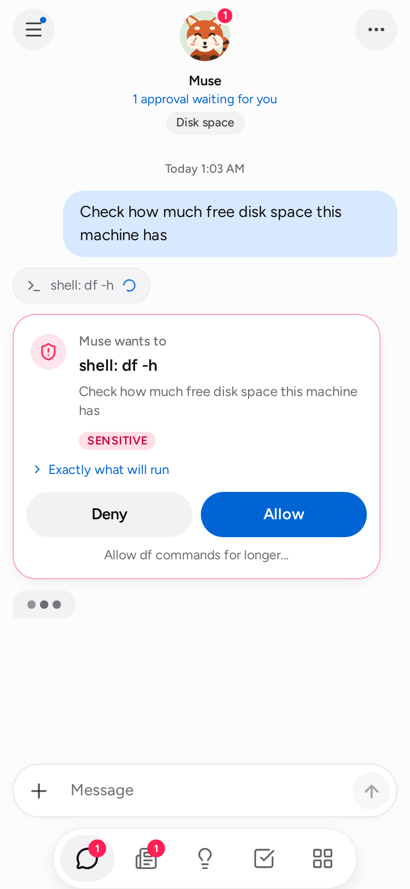
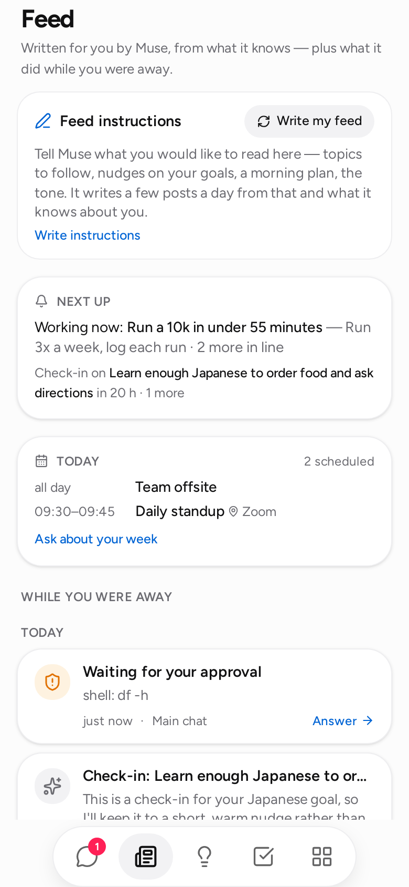
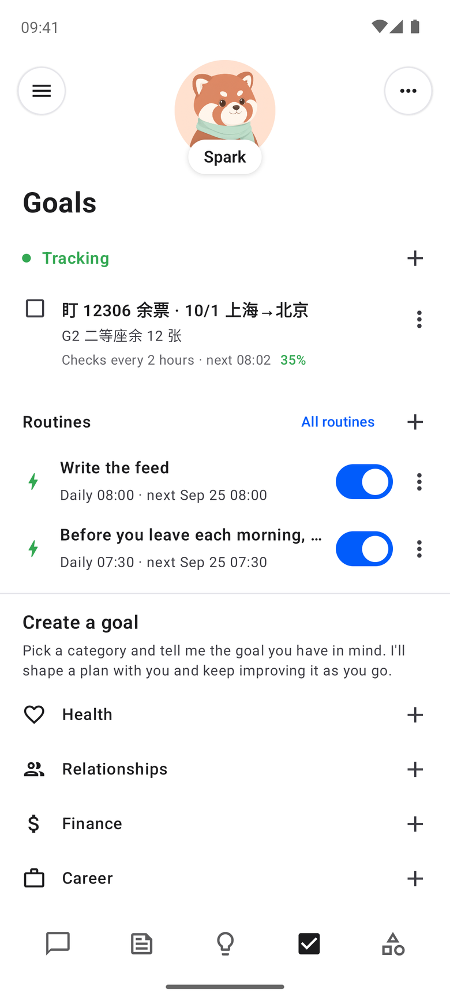
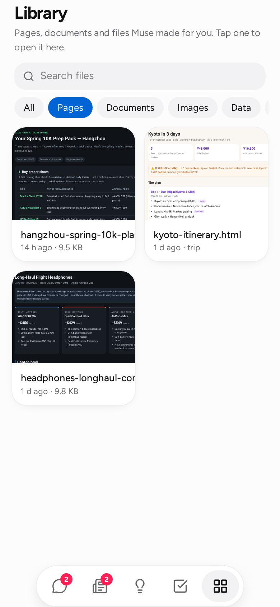
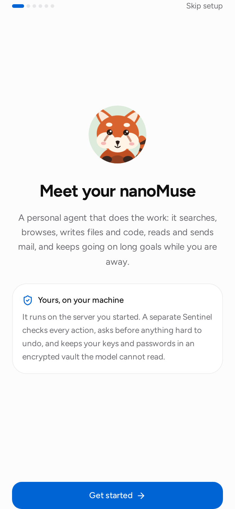

# The app

`nanomuse serve` runs an always-on agent and serves the phone app from the same process. The app is a React single-page app built into `nanomuse/server/static/` and shipped inside the Python package; the server is FastAPI with a WebSocket for live events.

```bash
nanomuse serve                      # http://127.0.0.1:8787, this machine only
nanomuse serve --host 0.0.0.0       # also reachable from your phone on the same network
nanomuse serve --port 9000 --no-qr
```

<p align="center">
  
  
  
  
</p>

The look follows Meta Muse: near-white and near-black surfaces, one blue accent, grey bubbles for the agent and light blue for you, a red panda at the top of the chat that changes pose with what the agent is doing, and a floating bar with five icons. The font is [Figtree](https://github.com/erikdkennedy/figtree) (OFL), bundled. The study behind these choices is in [design.md](design.md).

## Getting it onto your phone

1. Start with `--host 0.0.0.0` (or set `server.host`). The terminal prints a URL and a QR code.
2. Scan the code. The URL contains the access token (`?token=…`); the app stores it and drops it from the address bar.
3. In the browser menu choose *Add to Home Screen*. The app has a manifest and icons, so it opens full-screen like a native app.

The token is generated once and stored in `<data_dir>/server_token`; set `server.token` or `NANOMUSE_SERVER_TOKEN` to choose your own. Keep `server.auth = true` on any network you do not fully control. To reach the app from outside your network, put it behind something you trust (Tailscale, a reverse proxy with TLS) rather than opening the port.

## First run

<p align="center">
  
</p>

On a fresh data directory the app opens with setup instead of the chat. First three points about what it is — it does things for you; it keeps working when the app is closed; it asks you first where it matters — then a checklist of three items, ticked as they are done:

1. **Meet your nanoMuse** — the name first (1–20 characters; six suggestions and a shuffle; empty means nanoMuse), the avatar, a one-line tagline, then how it talks: a *tone* (formal / casual / playful / concise), *how much it says* (short / detailed / bullet points), anything else in your own words, and what it should call you.
2. **Add a model** — providers grouped by protocol (OpenAI-compatible Chat Completions · Responses API · local or your own endpoint) with vendor subtitles: DeepSeek, Kimi, Qwen, GLM, 豆包, MiniMax, OpenAI, OpenRouter, Ollama, or any OpenAI-compatible endpoint. The key is masked with a reveal toggle and each vendor has a *Get a key* link; it goes into the vault on the server and the model never sees it. A Base URL without a path gains `/v1`; Ollama and custom endpoints may have no key. The endpoint's own `/models` fills the list (a catalogue stands in when it cannot be reached); a model you typed is never replaced.
3. **Connect mail, calendar, contacts** — optional.

*Start* stays locked until a model is saved; *Skip setup* is always there. A reload keeps the ticks. Everything here can be changed later under the avatar (*Settings* shows the same identity form). Setup does not reappear once finished, or once a conversation exists.

## What is on the screen

Five tabs — Chat, Feed, Ideas, Goals, Library — and a menu behind the avatar.

**Chat.** One main conversation plus side chats (the *Chats* button top right). Messages stream in as they are generated. Tool calls appear as chips: tap one for the arguments and output. Files the agent writes show up as artifact cards that open in the app. When Sentinel needs a decision an approval card appears; when the agent needs information a question card appears. The composer stays open while the agent works; anything you send is folded into the running turn before the next model call.

*Attachments.* The paperclip (or a paste) attaches photos and files — up to ten per message, 25 MB each (`server.max_upload_mb`) — from the camera, the photo library or the phone's files. They upload as you pick them, show as thumbnails and chips you can remove, and a message may be attachments alone. Each file lands in the workspace under `attachments/<date>/` (so it is in the Library and any tool can use it) and the message lists them for the agent with what they are. Pictures go to the model as images when it takes them: `llm.vision = auto` sends them and, if the endpoint refuses (DeepSeek and most text-only models do), sends the text only from then on and tells you once — the picture stays as a file, the agent knows its name and says it cannot see it rather than guessing; `off` never sends pictures, `on` insists. Phone photos are scaled to 1568 px before they are encoded, so a 10 MB picture costs what a small one does. PDFs, spreadsheets and documents the agent reads with `files` — PDF text is extracted page by page (a scanned PDF says it has no text layer). In the chat, tap a picture or a file chip to open it.

*Browser view.* When the agent uses the browser tool, a browser card appears with what it is looking at: a picture of the page after every action, the page title, where it is, and what it just did ("Opened example.com", "Clicked 'Sign in'"). The card is LIVE while the run goes on and stays in the chat afterwards. Tap it for the full view; *Take over* puts you at the controls — tap the picture to click there, type into the focused field, press Enter, open a URL — and *Hand back* returns the page to the agent, which is told what you did and continues from there. That is how a login happens: the agent stops at the form and asks, you sign in, it carries on. Passwords you type go to the website, never through the model. Frames are kept in memory on the server for the current session only (the last dozen per chat); after a restart old cards show a placeholder. Needs the browser tool (`pip install "nanomuse[browser]" && playwright install chromium`, or the `-browser` Docker image) — or the Android app, whose own WebView is the agent's browser whenever the app is connected (the card says which: `backend`). In the app, *Take over* on such a card slides the real page up as a sheet rather than a picture of it; sign in with the phone's keyboard and autofill, tap **Done**, and the agent carries on. The whole story, including what cannot log in inside a WebView: [browser.md](browser.md).

**Feed.** Two things. At the top, *Feed instructions*: tell it what you want to read about ("keep me up to date on cycling and Rust, one recipe a week"), and once a day — or when you tap *New posts* — the agent writes three short posts for you from those instructions, your goals and what it remembers. Each post has *Ask {name}*, which starts a conversation about it. Below that, *While you were away*: one entry per background pass (its final word, and any file it made), every approval or question still waiting for you in any chat, today's calendar, and a *Next up* card that says when the next pass runs and which goal is in line. Unseen entries are counted on the tab.

**Ideas.** Suggestions generated from your goals, memory and recent conversation, grouped by area — planning, research, goals, money, health, home, learning, people, files, fun. Tap one to send it as a message; *Refresh* regenerates.

**Goals.** Two lists. *Tracking* is what gets checked on a schedule (a goal with a check-in cadence); *Goals* is the rest, done step by step. Each row has a check circle that fills as the plan progresses, one line of status (next check-in, last update, due date) and the count of steps done. Goals are created by the agent or by you (the `+` button), filed under an area of life — health, finance, career, learning, relationships, family, home, travel, creative — with an optional target date and an optional check-in cadence. Each goal has a plan; steps are pending, in progress, done or blocked, with notes. *Work on it now* runs one background pass on that goal and posts the result to the main chat; *Check in with me now* sends the reminder message right away.

- *Target date.* Cards say "Due in 5 days" / "Was due Sep 12"; overdue goals go first when the background pass picks what to work on, and the agent is told about them.
- *Check-ins.* "Every day at 08:00", "Weekdays at 07:30", "Mondays at 09:00", "Monthly on the 1st": at that time the agent sends one short message — what the goal is about, what the next small step is, how is it going — and does no work. Check-ins arrive at any proactivity level (you asked for them) but wait out quiet hours. The *Upcoming* view lists the next ones.
- *Plan changes.* When the agent learns the plan no longer fits, it does not edit it; it proposes a revised set of remaining steps with a reason. The proposal shows as a card at the top of Goals and inside the goal — *Use nanoMuse's plan* keeps the finished steps and swaps the rest, *Keep my plan* leaves everything as it is. Either way a note lands on the goal.

**Reminders and routines.** Say it in chat — "remind me at six to call mum", "every weekday at 07:30 give me a one-line weather check" — or add one under *Upcoming*. A *reminder* is one short message at the time you named, in the chat you set it from, and nothing else; a *routine* is a task the agent does at that time with its tools (read the inbox, check a page, run a script) and then reports on. Cadences are the check-in grammar: `daily 08:00`, `weekdays 07:30`, `weekly mon 09:00`, `monthly 1 09:00`. A time you named is kept whatever the proactivity level or the quiet hours; if the chat is busy the message queues behind the conversation rather than being skipped. Fired items stay listed for a week under *finished recently*. The same list is available from the terminal: `nanomuse reminders list | add | cancel`.

<a id="triggers"></a>**Triggers — when something happens.** The other half of reminders: work that starts from the world instead of the clock. Say it in chat — "when the landlord writes back, summarise it and draft a reply", "half an hour before any meeting with *review* in the title, put together a one-page brief", "when my deploy script calls you, check that the site is up" — or add one under *Upcoming → When something happens*. Three kinds: **new mail** (a message whose sender or subject contains every word you named arrives; the inbox is looked at every five minutes while such a trigger exists, and connecting a mailbox never replays old mail), **before an event** (a calendar event whose title or place matches is *N* minutes from starting), and **webhook** (a URL with a key; anything that can make an HTTP request — a CI job, a home-automation rule, a cron line with `curl` — `POST`s to it and the body becomes the context). Each time it fires the agent does the work in the chat the trigger was set from, with the mail, the event or the request in front of it, and the result lands in the Feed as *New mail: …*, *Coming up: …* or *Webhook: …*. The same thing never fires twice (a mail's UID, an event's start), a webhook refuses deliveries closer together than ten seconds, and a wrong key looks exactly like a wrong URL. Mail and events are your private data: from then on the session is tainted, so sending anything to a host that is not allowlisted needs an approval — and the model is told to treat what arrived as data, never as instructions. *Run now* fires one with a sample occurrence to see what it does; the list shows how often each fired and when the inbox was last read. From the terminal: `nanomuse triggers list | add | cancel`.

**Library.** Every file in the agent's workspace, newest first, filtered by kind (pages, documents, images, data, code) and searchable. Files open in the app: pages render live, Markdown is formatted, CSV becomes a table, images and PDFs display inline. A page the agent wrote runs in a sandboxed frame with an opaque origin — it cannot read the access token or call the API — and the server sends `Content-Security-Policy: sandbox` with every HTML file for the same reason.

**Avatar.** The red panda sits at the top of the chat with a status line under it — what the agent is doing right now in this chat, or that it is waiting for you. It is drawn live (an SVG, `web/src/components/RedPanda.tsx`) and holds a pose for each state: breathing, blinking and glancing about while idle; typing at a small laptop while it works; a raised paw and a "!" while it waits for you; a bounce when a run finishes; a worried shake when a tool call fails or is refused; asleep when the server is unreachable. Tap it and it is pleased about it. Settings offers six plush dolls and an emoji instead; those move as a whole (breathe, sway, hop) rather than changing pose. All of it stops under `prefers-reduced-motion`. The chat tab carries a badge with the approvals waiting anywhere. Tap the avatar for the status sheet: the avatar large, the same status line, a *Stop* button while something runs (the run ends, pending cards in that chat close, and the conversation stays usable), the model and the Sentinel mode, then:

- *Approvals* — the queue of cards waiting for you across all chats, answerable right there. Opens first when something is pending.
- *Activity* — the audit trail: every tool call, decision and approval, including refused ones.
- *Permissions* — the Sentinel mode, and every standing permission you granted with a revoke button on each.
- *Upcoming* — the background-work switch, the next pass time, the goals in line with a *run now* button, the next check-ins, your reminders and routines, and your triggers (*When something happens*), each with *+ Add*, *run now* and cancel; a webhook has a copy button for its URL.
- *Memory* — everything the agent has remembered about you, by category, plus an entry box. *Forget* deletes an item; the agent will not see it again. Each turn, the memories that fit the message go into the agent's prompt: by keyword, and — with an embedding endpoint set up under *Connections → Recall by meaning* — by meaning too, so "写邮件给房东" brings up "the landlord is Bob Li" though they share no word. *Tidy up* runs one pass of the housekeeping the agent also does on its own (after every eight new lines, or weekly, at any proactivity level but Off): lines that say the same thing are merged into one, a fact that changed keeps the newer version, and one-off requests that were never facts about you are dropped. The model proposes; nanoMuse checks that a merged line adds no words that were not there, refuses to drop anything you wrote yourself, and takes out at most a fifth of the store per pass. *Recent changes* lists every merge, drop and update with the text it replaced, each with *Undo*. A tidy-up that changed something is one entry in the Feed.
- *Skills* — how a job is done, written down once: a weekly review, a trip plan, an inbox triage. See [Skills](#skills) below.
- *Connections* — what the agent can reach, plugged in and out from the phone. **Model**: provider presets (DeepSeek, OpenAI, OpenRouter, Ollama, any OpenAI-compatible endpoint), model name, tool-calling mode, and the API key — which is written to the vault as `LLM_API_KEY` and swapped in for every thread on the spot; *Test* asks the model for a one-word reply. **Recall by meaning**: whether memories are also recalled by what they mean, through an OpenAI-compatible `/embeddings` endpoint — *Auto* (the model's endpoint when it has one, keyword recall when it does not), *On*, *Off*; the model's own endpoint or another one (Ollama with `qwen3-embedding:0.6b` next to DeepSeek, which has none — the key goes to the vault as `EMBEDDINGS_API_KEY`); the embedding model, blank for the endpoint's default. *Test* makes one embeddings call and, when it works, indexes every memory on the spot; the card's line says how many are indexed. **Web search**: who answers `web_search` — DuckDuckGo (nothing to set up, but scraped and rate-limited now and then), Brave Search or Tavily with a key (vault: `SEARCH_API_KEY`, with a link to where keys come from), or a SearXNG instance by URL; *Test* runs one search and shows the provider, the count and the time. Whatever is picked, a failed search falls back to DuckDuckGo with a note. **Email**: presets for common providers, address and app password (vault: `EMAIL_ADDRESS`, `EMAIL_PASSWORD`), IMAP/SMTP servers; *Connect* saves and signs in to both servers to prove it works; *Disconnect* removes the credentials and the tools. **Calendar**: add any private `.ics` link (the screen says where Google, Outlook, iCloud and Fastmail hide theirs) or a file path; the link goes to the vault as `CALENDAR_<NAME>`, the feed is read on the spot and its event count shown; working hours for *free time*; *Read again* re-fetches every feed. Today's events appear in the Feed under *Today* (tomorrow's once today is over), and the agent sees them in its prompt. An event the agent drafts opens as a card with *Add to calendar*. **Contacts**: upload a `.vcf` export from the phone (Google Contacts, iCloud, Outlook, the phone's own contacts app — the screen says where each hides the export), or give a path or a link (the link goes to the vault as `CONTACTS_<NAME>`); each address book shows how many people it has; *My contacts* is the book the agent fills from chat; a search field looks people up exactly as the agent does. **Browser**: on/off, with the install hint when Playwright is missing. **MCP servers**: add a server by command (stdio) or URL, choose the risk level of its tools, remove it again; servers from `config.toml` are listed read-only. **Vault**: the names of every stored secret, add or delete one. Only names ever leave the server.
- *Settings* — the agent's name, avatar, colour and personality, and what it calls you; the Sentinel mode (Balanced = `ask`, Cautious = `strict`, Hands-off = `auto`) and whether commands run in the [sandbox](sentinel.md#the-sandbox); proactivity (the Off / Low / Default / High dial, the check-in interval, quiet hours — see [Background work](#background-work)); notifications (below); *show thinking*; app language; reply language.

The app speaks English and 简体中文. *Settings → App language* is a device setting (stored in the browser, not on the server): *Auto* follows the browser's language, otherwise pick one; dates and relative times follow it too. It is separate from *Reply language*, which is what the agent writes in. Strings live in `web/src/i18n/` — the English text is the key, `zh-CN.ts` the translation, and a unit test fails when a string in the app has no translation.

### Skills

A skill is a recipe: a folder with a `SKILL.md` — a name and a one-line description up top, then the steps in Markdown — in the [Agent Skills](https://agentskills.io) format, so a skill written for another agent works here and yours work there. Five ship with the app (`weekly-review`, `trip-plan`, `inbox-triage`, `compare-options`, `meeting-prep`); yours live in `<data_dir>/skills/<name>/`, and one with the same name as a built-in replaces it.

The model sees the index — every enabled skill's name and description — in its system prompt and picks one when a request fits ("plan me a week in Kyoto" reaches for `trip-plan`), reading the full steps with the `skills` tool before it starts. You can also name one yourself: type `/` in the composer and the enabled skills come up (`Tab` completes the first match); `/trip-plan Kyoto, 5 days in November` sends the skill's instructions with your text as the task.

Three ways to get a new one. Write it in *Skills → New* (a template appears once the name is set), paste a link — a raw `SKILL.md`, or a GitHub folder or file page — and *Fetch*, or, after a job went well, tell the agent "save this as a skill": it writes down what it did as steps and asks you first (`skills` action=save is a sensitive call, so it needs your approval even in `auto` mode, and so does removing one). Switch a skill off to keep it out of the model's list; *Make your own copy* on a built-in opens it in the editor under your name. A skill's own scripts and reference files are visible read-only inside the [sandbox](sentinel.md#the-sandbox). From the terminal: `nanomuse skills list | show | add | new | remove | enable | disable`.

### Notifications

*Settings → Notifications → Let nanoMuse notify this device.* Standard Web Push through the browser's own push service, no account with anyone: the server generates a VAPID key pair once (`<data_dir>/push-vapid.json`) and keeps the subscriptions of your devices (`push-subscriptions.json`). You get a notification when the agent needs your approval, asks a question, finished a background pass that had something to report, or it is check-in time on a goal. Quiet passes and step-by-step narration never leave the app, and nothing is shown while the app is on screen — the card is already there. Tapping a notification opens the right chat. On a phone with the app on the home screen, the icon carries a badge with the number of cards waiting for you.

Push needs a secure context: `https://` or `localhost`. Over plain `http://` on your LAN the rest of the app works and the toggle explains why this part is off — see [deployment](deployment.md#reaching-it-from-outside-your-network) for a TLS setup. Embedded browsers (the kind inside another app) usually have no push service at all; use Chrome, Edge, Firefox or Safari 16.4+ (iOS: home-screen apps only).

Non-secret choices made in Connections are stored in `<data_dir>/app-settings.json` and layered over `config.toml` on every start — for the CLI too — so a phone-only setup never needs a file edited. Secrets are only ever referenced from there as `{{vault:NAME}}`.

### Opening the app on something

The page takes a few query parameters, which the Android app uses and a bookmark can too: `?thread=<id>` opens a conversation, `?tab=goals` (feed, ideas, library, connections) a tab; `&draft=<text>` puts text in the composer without sending it; `&attach=<json>` — the JSON list of `{path, name, mime, size}` that `POST /api/files/upload` returned — adds files already in the workspace as attachment chips. They are read once and removed from the address bar. This is how **Share → nanoMuse** works on the phone: the app uploads the shared files (`POST /api/files/upload`), starts a thread (`POST /api/threads`) named after the subject or the first file, and opens it with the text as a draft and the files attached, waiting for what to do with them. On the phone the agent also has the phone's own capabilities as tools and the workspace appears in the Files app — [device.md](device.md).

## Background work

Meta Muse "does things on its own, but not too much". The *Proactivity* dial in Settings sets how much:

| Level | Passes | Reaches out |
|---|---|---|
| Off | never | — |
| Low | every 2 × interval | only when a step got finished or it needs you |
| Default | every interval | when there is real progress or something you would want to know |
| High | every ½ interval | always, including "still on track" |

On each pass the service picks one active goal with a pending step, runs it in the main chat with the Sentinel in `auto` mode (explicit deny rules and dangerous-call warnings still apply — those turn into cards in the Feed), and lets the model decide whether the result is worth your attention. A pass with nothing to say begins its summary with `[quiet]`: the chat shows one muted line ("Checked on *goal* — nothing new", tap to expand), the Feed lists it as a one-liner, and nothing is badged. Anything else is a normal message from your nanoMuse.

*Quiet hours* ("22:00–08:00", server local time) hold background work; a pass that would fall inside the window runs when it ends. The *Upcoming* view and the Feed's *Next up* card show the level, the effective interval and the next pass time, or the end of the current quiet window.

Turn the dial to Off for goals that need your judgement at every step, or leave those goals paused.

## API

Everything the app does goes through this API, so another front-end (a Telegram bot, a desktop widget) can drive the same agent. All requests need `Authorization: Bearer <token>` or `?token=` unless `server.auth = false`.

| Method | Path | Purpose |
|---|---|---|
| GET | `/api/health` | liveness, version |
| GET | `/api/state` | profile, status, threads, pending approvals, goals, settings |
| GET / POST | `/api/threads` | list threads / create one `{title}` |
| PATCH / DELETE | `/api/threads/{id}` | rename / delete |
| POST | `/api/threads/{id}/clear` | clear the conversation |
| GET | `/api/threads/{id}/events?limit=&before=` | timeline events |
| POST | `/api/threads/{id}/send` `{text, files?}` | queue a message; returns immediately. `files`: workspace paths from the upload below, ten at most; text may be empty when there are files |
| POST | `/api/threads/{id}/stop` | stop the run in that chat: the queue is dropped, pending approval and question cards there expire, the conversation stays usable. `{ok: false}` when nothing was running |
| POST | `/api/files/upload?name=` (body: the bytes) | a file to attach: lands in `attachments/<date>/` under a safe version of `name`; returns `{path, name, size, kind, mime}` for `files`. 413 above `server.max_upload_mb` |
| POST | `/api/approvals/{id}` `{approved, scope, reason}` | answer a card; `scope` is one of the card's `grant_options` (`once`, `task`, `session`, `24h`, `always`) |
| DELETE | `/api/approvals` | forget every granted permission |
| DELETE | `/api/approvals/grants/{key}` | revoke one permission (`key` as listed by `/api/activity`, e.g. `shell:git`) |
| GET / POST | `/api/goals[?status=&category=]` | list / create `{title, description, steps[], category, due (YYYY-MM-DD), check_in ("daily 08:00", "weekdays 07:30", "weekly mon 09:00", "monthly 1 09:00")}` |
| GET / PATCH / DELETE | `/api/goals/{id}` | read / update `{status, note, step_index (1-based), step_status, step_note, title, description, category, due, check_in}` (`""` clears due / check_in) / delete |
| POST | `/api/goals/{id}/steps` `{title}` | add a step |
| POST | `/api/goals/{id}/advance` | run one background pass now |
| POST | `/api/goals/{id}/check-in` | send the reminder message now |
| POST / DELETE | `/api/goals/{id}/proposal/accept`, `/api/goals/{id}/proposal` | accept / dismiss the agent's proposed plan change |
| GET / POST | `/api/memory` · DELETE `/api/memory/{id}` | list / add `{content, category}` / forget |
| POST | `/api/memory/tidy` (`?dry_run=1`) | one tidy-up pass now; the report lists what was merged and dropped (or would be) |
| GET | `/api/memory/changes` · POST `/api/memory/changes/{id}/restore` | the log of merges, drops and updates, newest first; undo one |
| GET | `/api/ideas?refresh=1` | cached or regenerated suggestions |
| GET | `/api/activity` | audit tail, granted permissions (`grants[]` with `key`, `tool`, `target`, `scope`, `expires_at`), taint flag |
| GET | `/api/feed?limit=` | *While you were away*: `{id, ts, kind (background · artifact · approval · question), title, text, thread, thread_title, path}` newest first |
| GET | `/api/feed/posts` | the posts written for you: `{instructions, generated_at, posts[{id, ts, title, body, area, prompt}], error?}` |
| PUT | `/api/feed/instructions` `{instructions}` | what the posts should be about (≤ 2000 characters) |
| POST | `/api/feed/posts/refresh` | write new posts now; `error` says why not when the model refused |
| DELETE | `/api/feed/posts/{id}` | remove one post |
| GET | `/api/upcoming` | `{proactivity, proactive, interval_minutes, effective_interval_minutes, quiet_hours, quiet_until, next_pass_at, queue[{goal_id, title, category, due, overdue, next_step, progress}], check_ins[{goal_id, title, at, cadence}], reminders[], triggers{items[], available{mail, event, hook}, mail_checked_at, mail_error, mail_poll_minutes}, busy}` |
| GET / POST | `/api/reminders[?all=1]` | active (or all recent) reminders / create `{text, at ("YYYY-MM-DD HH:MM") or repeat ("daily 08:00", …), kind (remind · task), thread}` |
| POST / DELETE | `/api/reminders/{id}/fire`, `/api/reminders/{id}` | deliver it now in its chat / cancel |
| GET / POST | `/api/triggers` | triggers with which kinds have their connector / create `{kind (mail · event · hook), text, match, lead_minutes, thread}` — a hook comes back with its `url` |
| POST / DELETE | `/api/triggers/{id}/fire`, `/api/triggers/{id}` | run it now with a sample occurrence / cancel |
| POST | `/api/hooks/{id}?key=` | a trigger's webhook — no app token, the key is the credential (also accepted as `X-Hook-Key`); the body (≤ 64 KB, JSON pretty-printed) is the context. 404 for a wrong id or key, 409 once cancelled, 429 when deliveries come too close |
| GET | `/api/files` · `/api/files/{path}?download=1` | list / read workspace files (HTML and SVG are served with `Content-Security-Policy: sandbox`) |
| GET / PUT | `/api/settings` | view / change `{profile{name (≤ 20), avatar, emoji, color, tagline (≤ 60), tone, communication, style, user_name, proactive, goal_interval_minutes}, sentinel_mode, show_thinking, language}`; the view includes `onboarded` and `llm_ready` |
| GET | `/api/connections` | model (`key_source`: vault · config · missing · none), provider presets, email, browser, MCP servers (`connected`, `tools`, `from_app`), vault names, `onboarded` |
| PUT | `/api/connections/llm` `{provider, model, base_url, tool_mode, api_key}` | change the model; `api_key` set → stored in the vault, `""` → no key, omitted → unchanged. Takes effect immediately in every thread |
| POST | `/api/connections/llm/test` | one short round trip to the model: `{ok, reply, ms}` or `{ok: false, error}` |
| POST | `/api/llm/models` `{preset, base_url, api_key}` | the models an endpoint offers: its `/models` (then `/v1/models`) with the given key — or, without one, the key in the vault — `{models, source: "live"}`; when it cannot be reached, the preset's catalogue with `source: "catalogue"` and `error`. Saves nothing |
| PUT | `/api/connections/embeddings` `{mode, model, base_url, api_key}` | recall by meaning: `mode` auto/on/off; `base_url` `""` → the model's endpoint; `model` `""` → the endpoint's default; `api_key` set → vault (`EMBEDDINGS_API_KEY`), `""` → the model's key, omitted → unchanged. Rebuilds the embedder on the spot |
| POST | `/api/connections/embeddings/test` | one embeddings call, then every memory indexed: `{ok, model, dims, indexed, ms}` or `{ok: false, error}` |
| PUT | `/api/connections/search` `{provider, api_key, base_url}` | web search: `provider` duckduckgo/brave/tavily/searxng; `api_key` set → vault (`SEARCH_API_KEY`), `""` removes it, omitted → unchanged; `base_url` the SearXNG instance. Applies to the next search |
| POST | `/api/connections/search/test` | one search against the configured provider, no fallback: `{ok, provider, results, first, ms}` or `{ok: false, error}` |
| PUT / DELETE | `/api/connections/email` | save `{address, password, imap_host, imap_port, smtp_host, smtp_port, smtp_starttls, enabled}` (address and password go to the vault) / disconnect and forget the credentials |
| POST | `/api/connections/email/test` | sign in to IMAP and SMTP: `{ok, inbox}` or `{ok: false, error}` |
| PUT | `/api/connections/calendar` `{enabled, day_start, day_end, refresh_minutes}` | working hours and refresh; 400 for a malformed time |
| POST · DELETE | `/api/connections/calendar/feeds` `{name, url}` · `/api/connections/calendar/feeds/{name}` | add or replace a feed (the link goes to the vault as `CALENDAR_<NAME>`; read at once — `error` says why not) / remove one added from the app |
| POST | `/api/connections/calendar/test` | re-read every feed: `{ok, events, feeds}` or `{ok: false, error}` |
| GET | `/api/calendar` | `{configured, today, events[{uid, summary, start, end, all_day, location, description, calendar}], feeds[], fetched_at, stale}` — today's and tomorrow's events |
| PUT | `/api/connections/contacts` `{enabled}` | turn the contacts tool on or off |
| POST · DELETE | `/api/connections/contacts/sources` `{name, url}` · `/api/connections/contacts/sources/{name}` | add or replace an address book — a `.vcf` path, or a link kept in the vault as `CONTACTS_<NAME>` (read at once; `error` says why not) / remove one added from the app |
| POST | `/api/connections/contacts/import?name=` | upload a `.vcf` (the request body is the file) — kept under `<data_dir>/contacts/` and added as a source |
| POST | `/api/connections/contacts/test` | re-read every book: `{ok, contacts, sources}` or `{ok: false, error}` |
| GET | `/api/contacts?q=&limit=` | look people up as the agent does: `[{id, name, emails[], phones[], org, …}]` |
| PUT | `/api/connections/browser` `{enabled}` | turn the browser tool on or off |
| PUT | `/api/connections/gui` `{enabled, provider, model, base_url, api_key}` | operating the phone ([gui.md](gui.md)): the switch adds or removes the phone tools at once; the model fields are the operator's own model (`""` → the main model's); `api_key` set → vault (`GUI_API_KEY`), `""` → the main key, omitted → unchanged |
| POST | `/api/connections/gui/test` | one short round trip to the operator's model: `{ok, reply, ms}` or `{ok: false, error}` |
| GET | `/api/phone` | `{connected, device{id, name, platform, gui, apps, width, height}, gui_enabled, last_screen, screen}` — which phone is connected and the last screen it sent |
| POST · DELETE | `/api/connections/mcp` `{name, command, args[], env{}, url, risk}` · `/api/connections/mcp/{name}` | connect a server now (502 if it does not come up) / disconnect and remove one added from the app |
| GET | `/api/skills` | `{count, built_in, yours, dir, errors{}, skills[{name, description, source (built-in · yours), enabled, path, files[], metadata{}, channel, updated_at}]}` |
| GET / PUT / DELETE | `/api/skills/{name}` | one skill with `body` and `content` (the whole `SKILL.md`) / write it from `{content}` — a built-in name creates your copy / delete one of yours |
| POST | `/api/skills/{name}/enabled` `{enabled}` | switch a skill on or off (remembered in `app-settings.json`) |
| POST | `/api/skills/import` `{url}` | fetch a `SKILL.md` — a raw link, or a GitHub folder or file page — and save it |
| GET · PUT · DELETE | `/api/vault` · `/api/vault/{name}` `{value}` | list secret names / store / delete. Values are never returned |
| POST | `/api/onboarded` `{done}` | mark first-run setup as finished |
| GET | `/api/browser/{thread}/frames/{id}.jpg` | a browser frame (JPEG, in memory for the current session) |
| POST | `/api/browser/{thread}/control` `{action: click(x,y as 0–1 fractions) · type(text) · key(key) · scroll(dy) · navigate(url) · look · handed_back}` | you drive the agent's browser; `handed_back` is what the Android app sends when you close its take-over sheet (a fresh frame, the agent told); `409` when the browser is not open (open a URL first) |
| GET | `/api/push` | `{available, public_key, subscriptions, devices[]}` — the VAPID public key to subscribe with |
| POST | `/api/push/subscribe` `{subscription}`, `/api/push/unsubscribe` `{endpoint}` | register / drop this device's `PushSubscription` |
| POST | `/api/push/test` | send a test notification to every subscribed device |
| WS | `/ws?token=` | live events |

### WebSocket

On connect the server sends `{"kind": "hello", "state": …}` (the same payload as `/api/state`). Then:

| Server → client | Meaning |
|---|---|
| `event` | a new timeline event (`user`, `assistant`, `tool`, `approval`, `question`, `artifact`, `browser`, `notice`). An `approval` carries `summary`, `purpose` (what you asked for), `target`, `grant_key`, `grant_options`, `risk`, `warnings`, `args`. A `browser` card carries `url`, `title`, `action`, `frame` (id of the latest picture), `frames`, `status` (`live` / `done`), `by_user`, `backend` (`playwright` or `device`) and the frame's `width` / `height` in CSS pixels. Events produced during a background pass carry `source: "background"` and `about` (the pass label). The `assistant` bubble that ends a run carries `final: true` (set on emit, or as an `update` when the bubble was already on screen); the step-by-step narration before it does not — a client that mirrors background results into notifications should key off that flag |
| `update` | fields changed on an existing event (a tool finished, an approval was decided, a browser card got a new frame) |
| `stream_start` / `delta` / `stream_end` | the assistant reply being generated; `stream_end` carries `discard: true` when what streamed turned out not to be a reply (a prompt-mode tool call, a quiet background pass) |
| `status` | idle / working / waiting, with a short detail line |
| `thread`, `thread_cleared`, `thread_deleted` | thread list changes |
| `goals`, `memory`, `ideas`, `feed_posts`, `profile`, `settings`, `connections`, `skills`, `approvals_reset` | refresh hints for the tabs |
| `phone` | a phone connected or left: the `/api/phone` view |
| `device_ack`, `device_request` | to a connected phone: the answer to its announcement, and a request for its screen or an action ([gui.md](gui.md#the-device-protocol)) |
| `error`, `pong` | replies to client messages |

Client → server: `{"kind": "send", "thread": "main", "text": "…"}`, `{"kind": "approval", "id": "…", "approved": true, "scope": "once"}`, `{"kind": "ping"}`. A phone that lets the agent operate it also sends `{"kind": "device", …}` once and `{"kind": "device_result", …}` in answer to each request.

Timeline events are persisted per thread in `<data_dir>/threads/<id>.json`, so the history survives restarts.

## Developing the front-end

```bash
cd web && npm install
npm run dev          # Vite on http://localhost:5173, proxied to the server on 8787
npm run build        # writes nanomuse/server/static/ — commit the result
```

Add `cors_origins = ["http://localhost:5173"]` to `[server]` while using the dev server. The app is plain React + TypeScript + Tailwind with no state library; `web/src/store.tsx` holds the reducer and the WebSocket client, `web/src/screens/` one file per tab.
