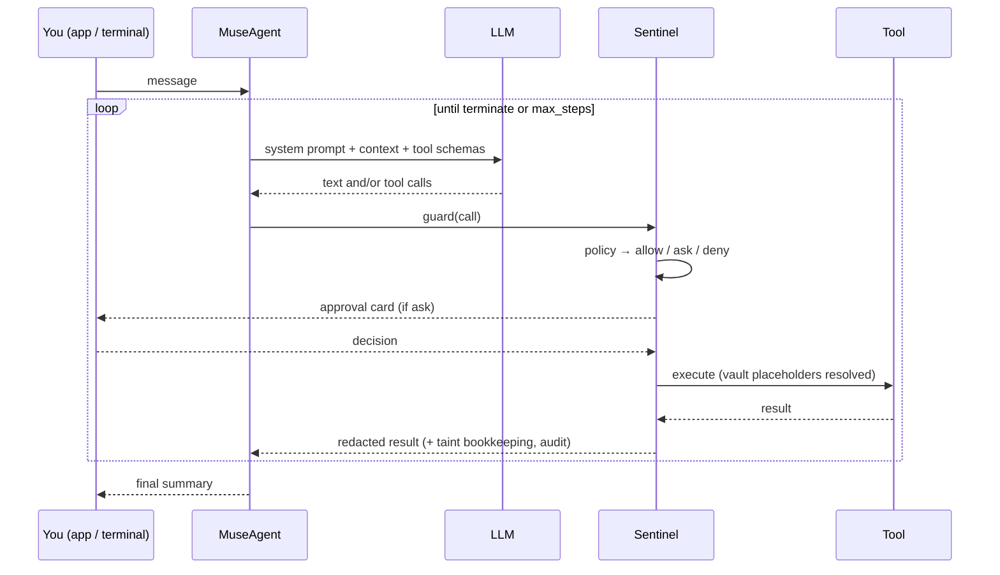

# Architecture

This page maps behaviour to source files. Read it before changing the agent loop, adding a tool, or touching anything Sentinel-related.

## One turn



`MuseAgent.run()` builds the system prompt once per turn (profile, language rule, relevant memories, active goals), then loops: ask the model, hand each tool call to `Sentinel.guard()`, append results, stop when the model calls `terminate` or replies without tools. Messages that arrive mid-turn (from the app) are folded in before the next model call. Stuck detection fires when the same call repeats without progress; `max_steps` forces a wrap-up.

## Source map

| Area | Files | Notes |
|---|---|---|
| Composition root | `nanomuse/app.py` | `NanoMuseApp` wires settings → LLM, tools, vault, Sentinel, memory, goals, agent |
| Agent loop | `nanomuse/agent/core.py` | prompt assembly, context trimming, stuck detection, session persistence, inbox |
| Prompts | `nanomuse/prompts.py` | system prompt, language rule and script detection, goal-advance prompt |
| Sentinel | `nanomuse/sentinel/gate.py`, `policy.py`, `audit.py` | guard, decision order, approvals, taint, vault resolution, redaction, JSONL audit |
| Vault | `nanomuse/vault/vault.py` | Fernet store, `{{vault:NAME}}` placeholders |
| Tool base | `nanomuse/tools/base.py` | `BaseTool`, `CallAssessment`, `ToolCollection`, `safe_execute` |
| Built-in tools | `nanomuse/tools/files.py`, `shell.py`, `web.py`, `email_tool.py`, `browser.py`, `memory_tools.py`, `goal_tools.py`, `terminate.py` | |
| MCP | `nanomuse/tools/mcp_tools.py` | stdio / streamable HTTP / SSE clients, one `MCPTool` per remote tool |
| The phone | `nanomuse/phone/link.py`, `screen.py`, `operator.py`, `trace.py`, `nanomuse/tools/phone.py` | connected devices and request/response over the app's WebSocket; the screen as a screenshot plus a caption; the operator loop (MemGUI `mobile_use` dialect, coordinates on a 999 grid) with its own model; JSONL traces and their HTML rendering; `phone_screen` / `phone_act` / `phone_task` and their Sentinel assessment ([gui.md](gui.md)) |
| LLM | `nanomuse/llm/base.py`, `openai_chat.py`, `openai_responses.py`, `prompt_tools.py`, `factory.py`, `mock.py` | `BaseLLM`, streaming with `<think>` filter, retries, prompt-based tool calling, `MockLLM` for tests |
| Memory, goals | `nanomuse/memory/store.py`, `nanomuse/memory/consolidate.py`, `nanomuse/goals/store.py` | SQLite; rare-word (IDF) ranking for memory injection; the tidy-up planner and its checks; a change log with undo |
| App server | `nanomuse/server/service.py`, `api.py`, `webui.py`, `events.py` | threads and workers, REST + WebSocket, `UI` implementation that turns callbacks into events, timeline persistence |
| Front-end | `web/src/` | React + TypeScript + Tailwind; `store.tsx` (state, WebSocket), `screens/` (tabs), `components/` (cards, avatar, markdown) |
| Terminal | `nanomuse/console.py`, `nanomuse/cli.py` | Rich console UI with inline approvals; Typer commands |
| Config, schema | `nanomuse/config.py`, `nanomuse/schema.py` | Pydantic settings, message and tool-call models |

## The `UI` protocol

Anything that can show the agent to a person implements `nanomuse/ui.py::UI`: text deltas, assistant messages, tool calls and results, Sentinel notices, `ask_approval()` and `ask_user()`. `ConsoleUI` is the terminal; `WebUI` turns the same callbacks into timeline events and WebSocket messages and parks approvals in futures until the app answers. A Telegram or desktop front-end would be another implementation of the same protocol, or a client of the HTTP API.

## Threads in the app

`MuseService` keeps one `MuseAgent` per thread, each with its own conversation and worker task, all sharing the memory and goals stores, the vault and the audit log. The main thread is the long conversation; side chats are separate threads; background goal passes run in their own thread and post a summary to the main one. A `contextvar` tells `WebUI` which thread a callback belongs to.

## Extension points

| Want to add… | Do this |
|---|---|
| A tool | subclass `BaseTool` in `nanomuse/tools/`, set `risk`, override `assess()` if a call can be more dangerous than the default, register it in `app.py::_build_tools`, add a test with `MockLLM` |
| A connector | prefer an MCP server (`[[mcp.servers]]`); write a tool only if the protocol does not fit |
| A model provider | most endpoints are covered by `openai` / `openai_responses`; otherwise implement `BaseLLM` and register it in `llm/factory.py` |
| A front-end | implement `UI` or drive the HTTP/WebSocket API in `docs/app.md` |
| A Sentinel behaviour | `policy.py` for decisions, `gate.py` for what happens around execution |

## Tests

```bash
python -m pytest -q                 # unit tests with MockLLM, no network
NANOMUSE_LIVE=1 python -m pytest -q -m live    # smoke test against your configured model
ruff check nanomuse tests && ruff format --check nanomuse tests
cd web && npm run build             # type-checks and rebuilds the app
```

`tests/test_server.py` drives the app server end to end with a scripted `MockLLM`: sending messages, approval cards, questions, goals, memory, files, settings.
