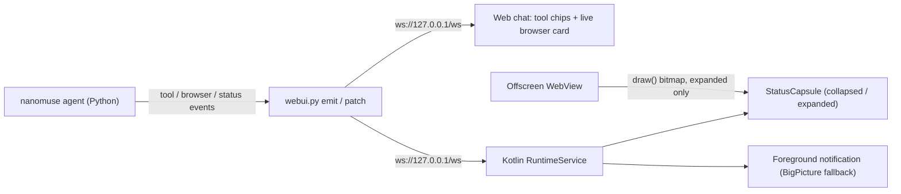

# Launch checklist — v0.1.0

Everything that has to happen before the first public release of nanoMuse, in the order it will be done. This is a working document: items are ticked as they land, and the [CHANGELOG](../CHANGELOG.md) records what shipped.

Priorities: **P0** — the release does not go out without it. **P1** — the release should have it. **P2** — can follow in a point release.

Decisions this list rests on (see [design.md](design.md) for the reasoning): the agent stays in Python and the Kotlin side is only a runtime host and an executor; nothing is copied from GPL projects, OpenMinis included — conclusions and pitfalls are borrowed, code is not; phase 1 is a *local* Android build (PRoot + Alpine + the `nanomuse` package inside the APK, the web app talking to `127.0.0.1`); users bring their own API key, there is no OAuth subscription login; operating the phone's screen is the last rung of a four-rung ladder (skills / MCP / CLI → logged-in fetch → the in-app browser → the phone's GUI) and a switch that is off by default; the Linux sandbox stays.

---

## 0. What ships, and how we know it is done

**Artifacts**: PyPI `nanomuse` · GitHub Release (`nanomuse-<ver>-local.apk` with the rootfs inside, `nanomuse-<ver>-connect.apk`, the rootfs, checksums) · a mirror at `dl.nanomuse.dev` · Docker image · the site at `nanomuse.dev` with the film · docs. The demo site (`demo.nanomuse.dev`) is already live; aligning it is P1 and not a release artifact.

**Acceptance (P0, all on real phones)**

- [ ] A fresh phone: install the local APK → name the agent → paste one Chinese model key → without touching a computer, complete the seven showcase cases, each leaving a replayable trace (two of them background web sites, exactly one GUI)
- [ ] Routines and goals keep moving with the app closed; approvals arrive as notifications
- [ ] With the phone-operator switch off, the agent is complete
- [ ] Compressed APK ≤ 80 MB; cold start (rootfs installed) ≤ 5 s; idle battery ≤ 3 % per 24 h
- [ ] Smoke test on 小米 / 华为 (EMUI) / OPPO / vivo / Samsung / Pixel
- [ ] The app, the launcher icon, the README, the site, the film and the demo show the same v2 red panda
- [ ] Measured from mainland China: first screen of the site < 3 s, APK downloads from `dl.`
- [ ] (P1) While a task runs in the background and the user is in another app, the floating capsule shows the current command or the browser picture and can stop the run

---

## 1. Immediate wrap-up (P0)

- [x] Push `478eeae` to `origin/main`
- [x] Remove rename leftovers (`openmuse/`, `io/github/openmuseagent/**`, `demo/mobilegym/apps/OpenMuse/`) — verified none tracked
- [x] `grep OpenMuse` across the repo — only the CopilotKit acknowledgements remain
- [x] This checklist

---

## 2. Mascot v2: the red panda (P0, before every screenshot and frame)

- [x] Redraw `web/src/components/RedPanda.tsx`: round ears, one cream face mask with a widow's peak, larger and lower eyes with a single highlight, a small nose and an ω mouth; drop the tear marks, brow dots and the second highlight; four radial gradients plus a crown sheen, no SVG filters; gradient ids prefixed with `useId`; `clipPath` for the round crop
- [x] `detail: "mark" | "avatar" | "hero"`; keep the six moods; move transform origins in `RedPanda.css`
- [x] Comparison sheet (current vs new × 16/40/96/200 px × six moods × light/dark), produced under `/tmp`
- [x] Regenerate: `icon.svg`, PWA icons, Android adaptive foreground and monochrome silhouette (flat), README cover, `site/assets/mascot.js`, MobileGym `res/icons.tsx` (`npm run mascot:assets`, `npm run site:mascot`, `scripts/mascot_png.py`); film frames are re-rendered with the film in §12
- [x] `docs/design.md`: the new spec and the decision record (red panda rather than giant panda; 2.5D rather than real 3D; flat icon)
- [x] Snapshot tests, `tsc`, vitest, rebuild the static bundle; CHANGELOG; commit and push
- [ ] P2: a plush-toy 3D render for the onboarding page, the site and store listings only

---

## 3. Local runtime (P0)

- [x] **rootfs built in CI** (buildx + QEMU): Alpine aarch64 + python3 + the `nanomuse` wheel and its dependencies; trimmed; versioned with checksums; Chinese apk/pip/npm mirrors chosen on first start from the phone's region (`nanomuse-mirror`) — `scripts/rootfs/`, `.github/workflows/rootfs.yml`; 315 MB unpacked / 67.9 MB xz with Node
- [x] **Node**: preinstalled (Node 22 + npm; `NODE=0` builds without, ~12 MB smaller) — recommended in, the owner confirms against the budget (local APK 72 MB release ≈ 75 MB debug, budget 80)
- [x] **proot built with the NDK**: Termux proot 5.1.107.94 + talloc 2.4.3 → `libproot.so` / `libproot-loader.so`; W^X handled through `nativeLibraryDir`; no 32-bit loader — `android/native/build-proot.sh`
- [x] **`LocalRuntime`**: first-run unpack with progress and a version marker (swap-in, old tree kept until the new one is in place); the proot argument set; DNS written from `ConnectivityManager`; `TZ` as the phone's IANA id; system proxy; `UV_LINK_MODE=symlink`; `nanomuse serve --host 127.0.0.1 --port <random> --token <random>`; health check, crash restart with backoff, logs rolled at 2 MB; `home/` survives upgrades
- [x] **`RuntimeService`**: foreground service of type `specialUse`; `PARTIAL_WAKE_LOCK` only while a task runs; the notification shows the current status `detail` (the §10 `tool_title` replaces it when it lands); subscribes to the local `/ws` event stream and feeds the shared `Notifier`; a Stop action; back after reboot
- [x] **Mode chooser**: Run on this phone / Connect to my computer; the WebView points at `127.0.0.1`; failure screen with the log tail, Try again, Start over
- [x] Python detects local mode (`nanomuse.runtime.device()`); the sandbox says so when bubblewrap is unavailable
- [x] **CLI bridge inside the rootfs** (`nanomuse/bridge/`, `/api/bridge/{kind}`, one token per command, nested Sentinel-guarded tool calls, `via: "shell"` on the timeline):
  - `nanomuse-device` (§6: clipboard / calendar / alarm / contacts / location / notifications / photos) — the Kotlin side of the tools is §6
  - `nanomuse-browser`: navigate / extract / click / type / fetch / screenshot — the device backend it drives is §4
  - `nanomuse-open <url>`: the rootfs `BROWSER`
- [ ] **Owner**: toolchain verified on a real phone, with traces: shell / python / files, apk, pip, git, curl, lark-cli, tmeet, `npx 12306-mcp`, the three bridge CLIs. Verified so far under QEMU (arm64 rootfs, not PRoot): `nanomuse serve` boots in ~14 s, `/api/health`, `device` detected, mirrors switch, the CLIs are on `PATH` — PRoot itself can only be exercised on a phone
- [x] Document the limits: PRoot is user-mode with no root; glibc binaries need `gcompat`; no Chromium in the rootfs (the browser is always the Kotlin WebView); ptrace makes syscall-heavy work slower — [docs/local-runtime.md](local-runtime.md)
- [ ] P2: a terminal page (xterm.js + pty)

---

## 4. Browser (P0)

- [x] `BrowserBackend` interface + `PlaywrightBackend` + `DeviceBackend`; `_ANNOTATE_JS` shared; `on_frame` identical — `nanomuse/tools/browser_backends.py`, `browser.py`
- [x] **Persistent Playwright profile**: `launch_persistent_context(workspace/browser-profile)`; verified: persistent cookies survive a restart, session cookies (no expiry) do not — documented
- [x] Device protocol `browser.*` (fourteen ops); capability declaration in the phone's hello (`"browser": true`) — `DeviceLink.kt`, `phone/link.py`
- [x] Kotlin offscreen WebView (`DeviceBrowser.kt`): a `Presentation` on a private `VirtualDisplay` (composited frames from its `ImageReader` are the screenshots), `measure/layout` + `draw` as the fallback; third-party cookies; native setters + `input`/`change` events for typing; a dialog queue; downloads into the workspace (local build) or the phone's Downloads (connect); one tab
- [x] **Hidden-throttling check**: measured on the Android 13 emulator with the app in the background — 60 rAF/s, `setInterval(10 ms)` at 100/s, `visibilityState = visible`
- [ ] The same measurement on a real phone (owner: needs a device; Android 8–10 and vendor ROMs)
- [x] UA / viewport profiles `mobile` / `desktop` / custom, on both backends (`profile` action, `[browser] profile`)
- [x] Take-over sheet: the same WebView moved into a bottom sheet, no reload; `userControl` mutex; **Take over** / **Done**; the web app sends `handed_back` and the agent gets a fresh frame — verified end to end on the emulator
- [x] Logged-in `fetch` action (rung two of the ladder), cookies both ways, `CookieManager.flush()` — verified: a cookie set by a page arrives in `fetch`
- [x] Logged-in requests from scripts: `nanomuse-browser fetch URL [--post BODY]`, `nanomuse-browser profile` (§3); exporting a cookie file stays P2
- [x] Document: Google login does not work inside a WebView; scanning a QR code on the same phone is not possible; passkeys are not portable — [browser.md](browser.md)
- [x] Unit tests: backend parity, protocol decoding, the Sentinel unchanged — `tests/test_browser.py`, `tests/test_bridge.py`
- [ ] Google domains → Custom Tabs automatically (today: the sheet's "open in the system browser" arrow; automatic hand-off is P2 because a login made there does not reach the WebView anyway)

---

## 5. Model access and first run (P0)

- [x] First-run checklist in this order: meet your nanoMuse (name it) → add a model → start; done items ticked, locked items greyed; ticks survive a reload (derived from the saved profile) — `web/src/screens/Onboarding.tsx`
- [x] Provider form: grouped by protocol with vendor subtitles; masked key with a reveal toggle; vendor-specific placeholders and a *Get a key* link; Base URL with "/v1 is added when the URL has no path" (`normalize_base_url`, preset hosts kept verbatim); Ollama and custom endpoints may have an empty key — `ModelCard` in `ConnectionsScreen.tsx`, `connections.py`
- [x] `/api/llm/models`: `/models` then `/v1/models` with the given or vaulted key, fall back to the preset's catalogue (`source` says which), never overwrite a typed model (a model carried over from another provider yields to the live list) — verified against a local Ollama
- [x] Chinese presets: DeepSeek / Kimi / Qwen / GLM / 豆包 / MiniMax, each with a link to get a key (`PROVIDERS`; catalogue names are a fallback — the live list is the source of truth and should be re-checked before release)
- [x] No OAuth subscription login (recorded in design.md, "Identity: the name comes first")
- [ ] P2: several instances, model groups

### 5a. Identity (as in Muse: the name comes first)

- [x] **P0** Naming page: 1–20 characters, empty falls back to nanoMuse; six suggested names as chips plus a shuffle; the avatar; a one-line tagline (`web/src/components/IdentityForm.tsx`, shared with Settings)
- [x] **P0** The welcome screen down to three points: it does things for you / it keeps working when closed / it asks you first where it matters
- [x] **P0** `Profile` (`nanomuse/server/service.py`) gains `tagline`; `style` splits into `tone` (formal / casual / playful / concise) + `communication` (short / detailed / bullets) + free text, each its own prompt paragraph — `tests/test_server.py::test_identity_fields_each_get_a_paragraph`
- [x] **P0** Name audit: system prompt, approval and permission copy (`MuseSheet.tsx`), Settings heading, MobileGym `bridge.ts` (name from the hello / profile), the CLI banner (`· <name>`); the Android foreground notification keeps the product name while starting (no profile yet) and shows the agent's status text once connected
- [ ] **P1** `identity` tool (set_name / set_tagline / set_avatar / set_style): renaming and avatar changes go through a choose/confirm card; tone changes apply at once with a one-line reply; "too long" / "more casual" map to settings
- [ ] **P1** `identity/IDENTITY.md` + `identity/SOUL.md`, readable and editable; profile → markdown one-way sync; an "Identity" row in the Muse sheet (IDENTITY / SOUL / memory) with reset to default
- [ ] **P1** `tidy` may propose SOUL.md revisions, surfaced as Ideas, never applied on its own
- [ ] **P1** Generic motion layer: plush dolls and custom images get the six mood poses and a mood badge too
- [ ] **P2** Generated avatars through `[image]`: 3–4 candidates → a choice card → `avatar.webp`
- [ ] An "Identity" section in `docs/design.md`; tests: validation, sync, tool and cards, name snapshots

---

## 6. Device capabilities (P0, seven of them)

- [x] Kotlin local MCP server (Streamable HTTP, `127.0.0.1` + token); registered automatically as the `device` MCP server (tools `device__*`); per-tool risk and taint through the new `MCPServerSettings.tools` overrides — [device.md](device.md)
- [x] `nanomuse-device` CLI inside the rootfs (the §3 bridge): `capability [action] k=v…`, single-word tools (`notify`, `location`, `calendars`) take no action word
- [x] Clipboard read/write, post a notification, calendar read/create/update/delete, contacts read-only, location, alarms and timers, the Photo Picker — all thirteen verified end to end on the emulator with the reference MCP client (permission dialog in the foreground, notification route from the background, declined and unanswered outcomes, clipboard from the background, alarm hand-off from the background, the picker)
- [x] Permission defaults in the Sentinel table (`DEVICE_TOOLS` in `runtime.py`, checked against the Kotlin list by `tests/test_bridge.py`); reading notifications is not offered — recorded as its own switch, off by default, for P2
- [x] `DocumentsProvider` (local build; compiles and lints, the root can only be seen on an arm64 phone — the emulator cannot install the local build); share sheet → a new conversation with the text as draft and the files uploaded (verified on the emulator from the Files app's share sheet)
- [ ] P1: device tools in connect mode need a relay over the phone's WebSocket (the server cannot reach the phone's `127.0.0.1`)
- [ ] P2: reading notifications, writing contacts, the whole photo library, SMS

---

## 7. Operating the phone's GUI (P0, switch off by default)

- [ ] `DeviceExecutor` interface; phase 1 ships only the accessibility backend
- [ ] `AccessibilityService`: `dispatchGesture`, `takeScreenshot` (API 30+), global actions, a node-tree dump with stable ids, `SET_TEXT` with a clipboard fallback, event waits
- [ ] `screen` / `act` wired into `mobile_use`; the node tree as a second input
- [ ] During GUI operation the §10 `StatusCapsule` enters its Stop state (`TYPE_ACCESSIBILITY_OVERLAY`: the v2 red panda + the current step + Stop; no screenshot, it is operating the very screen); `AskUserOverlay`
- [ ] Onboarding: enabling the service, Android 13+ restricted settings, recovery after the service is killed
- [ ] **The four-rung ladder in the system prompt**: skills / MCP / CLI → logged-in fetch → the in-app browser → the phone's GUI; the GUI only when asked explicitly, when a skill is `app-only`, or after the first three rungs failed; announced before entering, first action is `ask`
- [ ] `channel` in `SKILL.md`; the audit log records the channel; Activity shows the share of GUI steps
- [ ] Never types passwords or codes, never taps pay; sensitive words trigger a per-action ask
- [ ] Deferred to 1.5: the Shizuku / wadb tool group (default deny); a bundled IME

---

## 8. Background and system (P0)

- [ ] `setExactAndAllowWhileIdle` with a fallback when the permission is revoked
- [ ] Battery-optimisation guidance plus 小米 / 华为 / OPPO / vivo whitelist instructions; **the overlay permission too** ("display over other apps"; 小米 additionally "background pop-ups")
- [ ] Start on boot (optional); local-mode notifications stay in-process
- [ ] Crashes written locally only, no reporting; log export

---

## 9. Chinese services and the showcase (P0)

- [ ] **`docs/services.md`** in three tiers: verified (lark-cli, the 高德 MCP server, the 腾讯会议 CLI, 12306-mcp for queries) / to be run one by one (百度地图, 腾讯位置, 和风, 快递100, 钉钉, 语雀, 百度网盘, the 携程 / 飞猪 / 饿了么 servers on the 百炼 MCP market) / grey, not recommended (小红书 MCP, anything 微信). Rule: nothing enters the showcase until it has run inside the rootfs and left a trace
- [ ] New skills: `tencent-meeting`; `train-tickets` moved onto 12306-mcp; `kuaidi100` if it works; `config.toml` examples for 12306 / 快递100
- [ ] **Seven cases run on a phone, with traces**:
  1. A business trip in one sentence (12306 MCP + 高德 MCP + 飞书 CLI + calendar + a memory moment; no GUI)
  2. The morning brief (a routine + 高德 weather + 飞书 calendar and tasks + 腾讯会议 → a notification)
  3. Where is my 京东 order (background WebView; one take-over at the login wall; the login persists)
  4. A budget table for 成都 over the holiday (携程 / 去哪儿 browsed in the background → a table in the Library)
  5. Book a meeting and tell the group (腾讯会议 CLI + 飞书 CLI)
  6. Clipboard → calendar + alarm (the device MCP)
  7. A 美团 order that stops before payment (the only GUI case; the Sentinel closes it)
- [ ] GUI cases documented only: 交管12123 fines, 滴滴 up to the ride request, a 12306 app order up to submit, 京东 app cart up to checkout
- [ ] Rewrite `docs/showcase.md`: for every case the artifact screenshot, the chain of tools, a link to the trace
- [ ] Never in public material: automating 微信, 支付宝 statements, 医保 / 个税

---

## 10. The Muse shell and the experience

- [ ] **P0** `tool_title` drives the red panda's status and the tool-card title (Muse: emoji + task name)
- [ ] **P1 `StatusCapsule`, a two-level floating window** (matches and goes beyond OpenMinis's `ToolOverlayController`, which is a text-only pill without a stop button)
  - Collapsed (default): the v2 red panda mark + `tool_title` + one live status line (`$ command` or the browser action, e.g. "Clicked '我的订单'") + a progress ring; a success/failure glyph when done; **Stop** while running; turns amber and opens the approval card while waiting for one
  - Expanded (tap the chevron): a card of about 200×140 dp. Shell mode: the last 3–5 commands with exit codes and the last output line, monospace. Browser mode: a thumbnail of the page + the URL. Buttons: Open / Take over / Stop
  - Data: the Kotlin host subscribes to `ws://127.0.0.1:<port>/ws` for `tool` events (with the `args` command preview and the `output` patch), `browser` events (frame ids) and `status` — the same stream the in-app chat renders. The local build draws the WebView bitmap directly at ≤ 2 fps and only while expanded; the connect build uses the `/api/.../browser_frame` JPEGs
  - Behaviour: bottom-left by default, draggable with the position remembered, swipe left to dismiss for this run; collapses after 30 s without interaction; hidden while the app is in the foreground; display only, no touch pass-through
  - Window backend: `TYPE_ACCESSIBILITY_OVERLAY` when the accessibility service is on (no extra permission) → otherwise guide the user to "display over other apps" and use `TYPE_APPLICATION_OVERLAY` → otherwise fall back to the foreground notification (`BigPictureStyle` with the thumbnail)
  - Off by default; a card suggests turning it on the first time a task runs in the background; switches to the Stop state during GUI operation (§7)
- [ ] **P1** Name pill overlapping the avatar with an emoji status; confetti on completion
- [ ] **P1** Two-line tool cards; approval cards aligned with Muse
- [ ] **P1** The local-mode unpack page uses the animated v2 red panda
- [ ] **P2** Streaming `shell` stdout: read line by line and `patch` partial output every 500 ms (today `proc.communicate()` returns everything at the end, so a long command only shows "running"); the chat tool card and the capsule both benefit
- [ ] **P2** Voice (`/api/transcribe`)

---

## 11. Security, privacy and compliance (P0)

- [ ] `THIRD_PARTY_NOTICES.md`: proot (GPL-2.0, a separate program; upstream commit, build script, where to get the source), Alpine package licences, Readability / buildDomTree if used, Shizuku if used, Remotion if used, the music licence; design acknowledgements for OpenMinis / ClawGUI / roubao
- [ ] `CONTRIBUTING.md`: MIT; no GPL code; borrow conclusions, not expression
- [ ] Privacy note: what leaves the phone; taint and egress rules for screenshots and screen trees; the capsule thumbnail is shown on this device only; no telemetry
- [ ] The Meta trademark notice in the APK's About page and the site footer
- [ ] Accessibility-use disclosure; overlay-use disclosure; the account risk of automating third-party apps
- [ ] **Promotional material**: third-party interfaces appear only as functional demonstrations; order numbers, phone numbers and addresses always blurred; the 美团 shot stops before payment with "payment is yours"; 12306 queries or books one ticket, never scalps
- [ ] `SECURITY.md` reviewed; the Sentinel defaults in `docs/sentinel.md`
- [ ] Local mode: `127.0.0.1` + a random token; cleartext for localhost only; the bridge CLIs use the same token

---

## 12. Build, CI and release (P0)

- [ ] `rootfs.yml`; `android.yml` builds the local and connect APKs with a size gate
- [ ] `release.yml`: two APKs, the rootfs, checksums, notes; rsync to `dl.nanomuse.dev` in the same run
- [x] PyPI pending publisher verified (`nano-muse/nanoMuse` + `release.yml` + environment Any, matching `environment: pypi` / `id-token: write`; the name `nanomuse` is free)
- [ ] First PyPI release: push a `v*` tag (must equal the `pyproject.toml` version); optionally tighten the environment to `pypi`
- [ ] Decide whether to publish an `openmuse` 0.7.x transition release that only depends on `nanomuse`
- [ ] Docker; review `showcase.yml`
- [ ] Signing secrets (added by the owner, or with explicit authorisation); version numbers aligned; CHANGELOG final; tag

---

## 13. Tests and quality (P0)

- [ ] Python: backend abstraction, protocol, the four-rung ladder, permission defaults, `/api/llm/models`, identity sync and tool, the `nanomuse-browser` / `nanomuse-open` CLIs, stdout streaming if built
- [ ] Web: vitest + `tsc` (onboarding, provider form, RedPanda, identity page)
- [ ] Kotlin: proot argument assembly, tar unpack, protocol, a11y node tree, `StatusCapsule` event mapping (tool → text, browser → frame, waiting → approval) and both window backends
- [ ] Phone script over adb: install → unpack → start the service → the seven cases
- [ ] Performance budget measured; the six-OEM matrix for accessibility, keep-alive and overlays

---

## 14. Documentation (P0)

- [ ] `docs/android.md` local mode + the capsule and its permission; `docs/design.md` (mascot v2, identity, Muse UI, the ladder, the permission table, no OAuth, StatusCapsule); `docs/gui.md`; `docs/architecture.md` local topology and the CLI bridge; `docs/configuration.md`; `docs/troubleshooting.md`; `docs/services.md`; `docs/showcase.md`; this checklist kept current
- [ ] roadmap / README / README_zh in sync; every link to `nanomuse.dev`; screenshots retaken after mascot v2

---

## 15. The site (P0)

- [ ] **Apex online**: a `nanomuse.dev` vhost in the Caddyfile (static `/srv/www/site`), `www` 301, the `dl.` mirror; Cloudflare DNS A records (the token is on the server); fixes the current 500
- [ ] `pages.yml` publishes twice: the Pages mirror (deploy key pushing to the root of `nano-muse.github.io`, with a canonical link) + rsync to the server; retire the `/nanoMuse/` path; update the repository homepage field
- [ ] **Eight sections**, copy written separately in Chinese and English, not translated: Hero (one line + one sentence + Download / GitHub + a quiet "try it in the browser" + a muted looping phone video) / Watch it work / Many hands (four tiles) / A Chinese day (seven case cards with trace links) / It asks first where it matters / Runs on your phone (the local build + what leaves the phone + a row of models) / Install (the three APK steps first, pip / Docker folded) / Footer
- [ ] Copy rules: headlines ≤ 6 characters / 4 words; one idea per section; numbers over adjectives; banned: 赋能 / 一站式 / 极致 / 丝滑 / seamless / empower; no exclamation marks, no emoji headings; limits stated (Alpha, GUI needs Android 11+, Google login, no payments)
- [ ] Real screenshots of real apps on one device frame and background; the red panda only in the hero and the ending
- [ ] Self-hosted fonts: Figtree + a Noto Sans CJK SC subset; no overseas CDN; first screen < 3 MB; measured from the mainland
- [ ] P2: self-hosted Umami on the same server to count downloads

---

## 16. The film (P0)

- [ ] Footage: `scrcpy --record` at 60 fps on a real phone — real 飞书 / 高德 / 12306 MCP / 腾讯会议 / 京东 / 携程 / 美团; no more mock-ups
- [ ] Assembly: keep `storyboard.html + render.py` with real recordings; or Remotion (licence noted)
- [ ] Shot list: 0–4 s the red panda + one line → 4–34 s the hero case with no GUI ("if there is an API, it does not tap the screen") → 34–44 s the 京东 login wall → take-over sheet → the run continues → 44–52 s the morning-brief notification + clipboard into the calendar → 52–60 s 美团 stopping before payment, the approval card → 60–66 s "runs on your phone · your key · payment is yours" → end card nanomuse.dev + GitHub; a capsule shot may go into the 4–34 s section (switch to another app, commands scrolling in the capsule)
- [ ] Deliverables: the 16:9 film in Chinese and in English; 9:16 × 3 (the business trip / the morning brief / the phone moving on its own); a 6 s GIF/WebM for the README and the social preview
- [ ] Sound: CC0 / CC-BY music + light UI sounds, listed in NOTICES; no narration, no TTS; burned-in subtitles
- [ ] Blur order numbers, phone numbers, addresses; replace `site/media/`

---

## 17. Aligning the demo site (P1, after the APK)

- [ ] Gateway `/mcp/<name>` streaming reverse proxy; upstreams only 高德 (our key injected), 和风, a self-hosted 12306-mcp; `mcp-12306` in compose on two networks; the sessions network stays `--internal`
- [ ] Container default config points at `http://gateway:8000/mcp/{amap,qweather,12306}` with the `amap` / `train-tickets` skills
- [ ] MCP quotas per session and per day, audited; test first whether 12306 answers from a Hong Kong IP; 高德 quota alerts
- [ ] Step two: a tinyproxy / squid allowlist forward proxy (`mp.weixin.qq.com`, 携程 search pages, …); Playwright uses the same proxy
- [ ] Not in the demo: any site that needs a login (京东), any CLI that needs an account (飞书, 腾讯会议)
- [ ] `res/icons.tsx` on v2; the site frames the demo as "see how it works, in the browser", below the download button
- [ ] P2: an online trial running the real APK on a cloud phone

---

## Explicitly not in the first release

OAuth subscription login · Shizuku / wadb backend · several instances and model groups · rclone backup · reading notifications · iOS · large 3D renders · generated avatars · cloud-phone trial · operating the browser inside the floating window (PiP style) · phase 2 cloud VM · phase 3 desktop.

## What only the owner can do

**Now (needed during M0–M2)**

- Four decisions (one reply, "as recommended", is enough): version 0.1.0; Muse's missing features / voice / starter quota all after the release; Node preinstalled in the rootfs; `nanomuse.dev` canonical with `nano-muse.github.io` as a mirror
- An Android 11+ phone with USB debugging, connected to this machine (`adb devices` sees it); ideally a 小米 or 华为 as a second device
- A 高德 web-service key; one official DeepSeek key; the 腾讯会议 `tmeet` OAuth step clicked in a browser when we get there; a 飞书 "project group" that can be filmed and one or two accounts that can be @-mentioned
- [x] The PyPI pending publisher (verified)
- Confirm `ghcr.io/nano-muse/nanomuse` is public
- The four Android signing secrets (`ANDROID_KEYSTORE_B64` / `ANDROID_KEYSTORE_PASSWORD` / `ANDROID_KEY_ALIAS` / `ANDROID_KEY_PASSWORD`; the keystore lives in `~/.openmuse-release/`): added by the owner, or with explicit authorisation
- Two deploy keys, pasted once generated: a deploy key for `nano-muse.github.io` and the server rsync user's private key, both as repository secrets
- A look at the Hong Kong server's traffic allowance (80 MB × downloads)
- Whether to publish the `openmuse` 0.7.x transition release

**Before filming (M5)**

- Log in to 京东, 美团, 飞书 and 腾讯会议 on the phone; agree that these accounts appear on screen, blurred
- A native-speaker pass over the eight sections and the subtitles
- Listen to two or three music candidates
- Accounts on the channels: 知乎 / V2EX / 小红书 / B站 / 酷安 / 即刻

**Not needed from the owner**: DNS, the Caddy vhost, the rootfs / proot builds, the mirror repository's contents, the demo gateway, trace generation, the capsule and the CLI bridge.

## Order of work

M0 wrap-up + mascot v2 (§1–2) → M1 local runtime (§3, including the CLI bridge) → M2 browser + onboarding + identity P0 (§4–5) → M3 device capabilities + GUI + background + services and the seven cases (§6–9) → M4 shell (including `StatusCapsule`) + identity P1 + compliance + docs (§10–11, 14) → M5 phone footage → site + film (§15–16) → M6 CI / release / test matrix (§12–13) → after the release, the demo site (§17).

Site work that needs no footage (the Caddy vhost, DNS, `dl.`, the dual `pages.yml` publish, the mirror repository, first drafts of the copy) runs in parallel with M1; the collapsed `StatusCapsule` can be built as soon as M1's `RuntimeService` exists.
